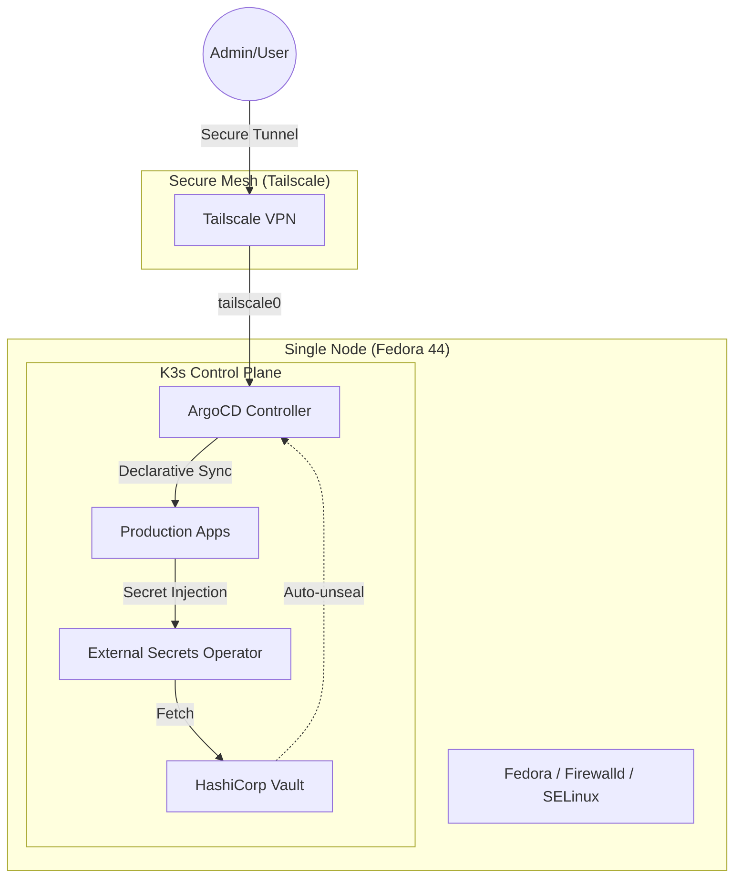

# Secured GitOps Homelab
> **Enterprise-grade DevSecOps Journey on K3s & Tailscale**

[](https://k3s.io/)
[](https://argoproj.github.io/cd/)
[](https://www.vaultproject.io/)
[](https://tailscale.com/)

## 🚀 Overview

This repository documents my **DevSecOps Homelab** journey. The goal is to build a fully automated, production-ready Kubernetes environment focused on **GitOps principles**, **Zero-Trust networking**, and **Advanced Secret Management**.

It’s designed to be lightweight enough for a single laptop but robust enough to showcase enterprise patterns that scale.

## 🏗 Architecture

The cluster leverages **Tailscale** to create a secure Mesh VPN, allowing for seamless inter-node communication and remote management without exposing ports to the public internet.



## 🛡 Key DevSecOps Features

- **GitOps Flow**: Everything is declarative. ArgoCD manages the state of the cluster, from foundational platform components to user applications.
- **Hardened Networking**: Using Tailscale for node identity and inter-pod communication. No public ingress required for internal services.
- **Secrets Management**: 
    - **HashiCorp Vault**: Centralized authority for all sensitive data.
    - **External Secrets Operator (ESO)**: Synchronizes Vault secrets into native Kubernetes Secrets automatically.
    - **At-Rest Encryption**: K3s configured with `secrets-encryption: true` using AES-CBC.
- **OS Hardening**: Optimized for Fedora with strict Firewalld rules and SELinux integration.

## 🛠 Tech Stack

| Category | Tool | Purpose |
|----------|------|---------|
| **Orchestration** | K3s | Lightweight, production-ready Kubernetes |
| **GitOps** | ArgoCD | Continuous Delivery & State Reconciliation |
| **Secrets** | Vault + ESO | Enterprise secret lifecycle management |
| **Networking** | Tailscale | Zero-trust Mesh VPN & secure access |
| **Certificates** | Cert-Manager | Automated TLS lifecycle |
| **Monitoring** | Prometheus/Grafana | (In roadmap) Observability |

## 🏁 Getting Started

If you want to replicate this lab or fork it for your own use:

1.  **Fork the Repo**: Click the "Fork" button and follow the [Customization Guide](doc/customization-guide.md) to update repository references.
2.  **Preparation**: Follow the [K3s Install Guide](doc/k3s-install.md) for Fedora/Tailscale setup.
3.  **Full Guide**: Read the [Getting Started](doc/getting-started.md) documentation for the step-by-step walkthrough.


## 📂 Project Structure

```
argocd-gitops-homelab/
├── bootstrap/                  # One-shot init scripts
│   └── 01-init-gitops.sh       # Bootstraps ArgoCD & points it to this repo
│
├── platform/                   # Platform-level components (Helm charts)
│   ├── argocd/                 # ArgoCD Helm values & config
│   ├── vault/                  # HashiCorp Vault chart + auto-unseal scripts
│   ├── external-secrets-operator/  # ESO chart + Vault connection
│   └── tailscale/              # Tailscale operator for secure ingress
│
├── apps/                       # User-facing applications
│   ├── immich/                 # Photo management app (placeholder)
│   └── template-pod-tailscale/ # Reusable template: deployment + service + tailscale ingress
│
├── gitops/                     # Root "App of Apps" Helm chart
│   ├── Chart.yaml              # Meta-chart that orchestrates everything
│   ├── values.yaml             # Production values (env-driven)
│   ├── values-dev.yaml         # Development overrides
│   └── templates/              # ApplicationSets & root app definitions
│
├── infra/                      # Infrastructure utilities
│   ├── init-infra.sh           # Node-level setup script
│   ├── storage/                # Local-path provisioner configs (K3s / Minikube)
│   └── update/                 # K3s update planning manifests
│
├── doc/                        # Step-by-step documentation
│   ├── getting-started.md      # Full walkthrough
│   ├── k3s-install.md          # Fedora + Tailscale setup
│   ├── customization-guide.md  # How to fork & adapt
│   ├── secrets-structure.md    # Vault secret organization
│   ├── sync-waves.md           # ArgoCD sync ordering
│   └── secrets-steps/          # Visual guides for Vault setup
│
└── .env                        # Environment variables (gitignored in production)
```

## 📈 Roadmap

### Phase 1 — Foundation ✅
- [X] Bootstrap script for ArgoCD (GitOps entry point).
- [X] Vault deployment with auto-unseal via ArgoCD.
- [X] Cert-Manager integration for Vault TLS.
- [X] External Secrets Operator syncing Vault → K8s secrets.
- [X] Tailscale operator for secure zero-trust ingress.

### Phase 2 — Automation & Observability 🚧
- [ ] **Automated Image Updates** — Renovate bot for dependency tracking.
- [X] **Monitoring Stack** — Prometheus + Grafana + Loki for full observability.
- [ ] **Alerting** — AlertManager rules + notification channels.

### Phase 3 — Hardening & Scale 📋
- [ ] **Network Policies** — Cilium or Calico for pod-level segmentation.
- [ ] **Multi-node HA** — Evaluate Tailscale-based multi-node K3s topology.
- [ ] **Backup & DR** — Velero or k8up for cluster state backups.
- [ ] **Policy Enforcement** — OPA/Gatekeeper or Kyverno for admission control.

### Phase 4 — Developer Experience 💡
- [ ] **CI/CD Pipeline** — GitHub Actions for lint, test, and preview environments.

---
*Created by [Seom88](https://github.com/Seom88) - Built for learning, security, and automation.*
