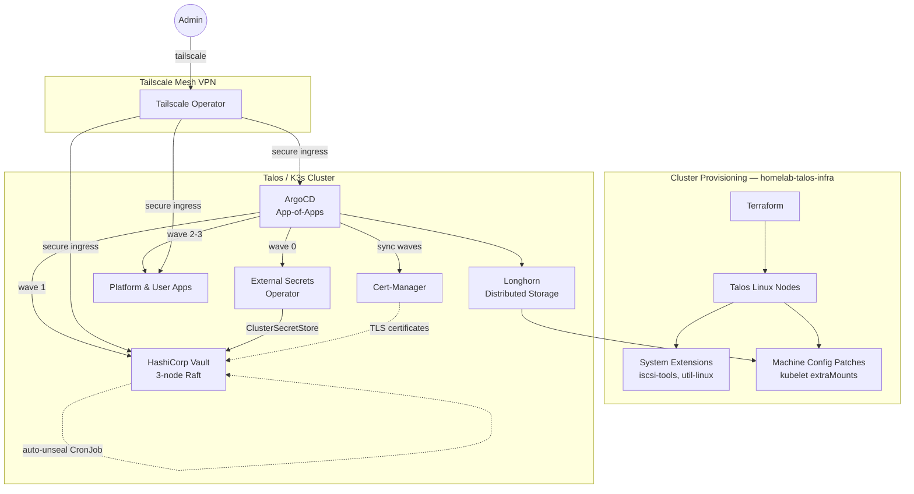

# Secured GitOps Homelab

[](https://www.talos.dev/)
[](https://argoproj.github.io/cd/)
[](https://www.vaultproject.io/)
[](https://tailscale.com/)
[](https://github.com/Seom88/infra-talos-homelab)

> **Companion project:** Cluster provisioning (Talos + Terraform) at  
> [`github.com/Seom88/infra-talos-homelab`](https://github.com/Seom88/infra-talos-homelab)

Enterprise-grade DevSecOps homelab with GitOps, zero-trust networking, and secrets management — running on Talos (production) and k3d (development).

## 🚀 Overview

Fully automated Kubernetes environment focused on **GitOps principles**, **Zero-Trust networking** via Tailscale, and **Advanced Secret Management** with Vault + External Secrets Operator.

Dual-environment architecture: **Talos** for production, **k3d** for local development — both consuming the same GitOps repo.

## 🏗 Architecture



## 🛡 Key DevSecOps Features

- **GitOps Flow**: ArgoCD manages everything declaratively via App-of-Apps pattern. Bootstrap script goes from bare cluster → fully operational in one shot.
- **Immutable Infrastructure**: Talos Linux for production — no SSH, no package manager, API-only management. k3d for rapid local development with the same GitOps repo.
- **Zero-Trust Networking**: Tailscale operator provides secure ingress without exposing ports — every service gets a `.tailnet` domain.
- **Secrets Management**:
  - HashiCorp Vault (HA, 3-node Raft) with auto-unseal via CronJob
  - External Secrets Operator syncs Vault → native Kubernetes Secrets
  - Per-service ClusterSecretStores for least-privilege access
  - Secrets encryption at rest via KMS
- **Certificate Automation**: cert-manager issues and renews TLS certificates for Vault and cluster services.
- **Observability**: Prometheus + Grafana + Loki stack with Vault-injected credentials.
- **Architecture Decision Records**: ADRs document key decisions and their tradeoffs.

## 🛠 Tech Stack

| Category | Tool | Status |
|----------|------|--------|
| **Provisioning** | Terraform + Talos (`homelab-talos-infra`) | ✅ Companion repo |
| **Orchestration** | Talos (prod) / k3d (dev) | ✅ Dual-env |
| **GitOps** | ArgoCD | ✅ App-of-Apps |
| **Secrets** | Vault (HA Raft) + ESO | ✅ Per-service stores |
| **Networking** | Tailscale Operator | ✅ Ingress templates |
| **Certificates** | cert-manager | ✅ Vault TLS |
| **Monitoring** | Prometheus + Grafana + Loki | 🚧 Ingreses disabled |
| **Storage** | local-path provisioner | ✅ Default |

## 🏁 Getting Started

This is the **GitOps layer** — it assumes a running cluster. Cluster provisioning is in the [infra repo](https://github.com/Seom88/infra-talos-homelab).

If you want to replicate or fork this lab:

1. **Fork both repos** — Update repository references in the [Customization Guide](docs/customization-guide.md).
2. **Provision the cluster**:
   - **Production (Talos)**: Use [`infra-talos-homelab`](https://github.com/Seom88/infra-talos-homelab) — Terraform creates VMs, installs Talos, applies system extensions and machine config patches (Longhorn mounts, etc.)
   - **Development**: Use `k3d` with `infra/k3d/k3d-config.yaml` — no separate infra needed.
3. **Bootstrap**: Run `bootstrap/01-init-gitops.sh` to deploy ArgoCD → App-of-Apps → Vault → everything.

Bootstrap auto-detects the environment (Talos / K3s / Minikube) and adapts accordingly.

## 📂 Project Structure

```
secured-gitops-tailscale-homelab/
├── bootstrap/                   # One-shot init scripts
│   └── 01-init-gitops.sh        # Bootstraps ArgoCD & points it to this repo
│
├── platform/                    # Platform-level Helm charts
│   ├── argocd/                  # ArgoCD Helm values (HA config, health checks)
│   ├── vault/                   # Vault HA chart + auto-unseal + ESO configs
│   ├── monitoring/              # Prometheus / Grafana / Loki stack
│   ├── tailscale/               # Tailscale operator + ingress templates
│   ├── longhorn/                # (planned) Distributed block storage
│   └── seaweedfs/               # (planned) S3-compatible object storage
│
├── apps/                        # User-facing applications
│   └── template-pod-tailscale/  # Reusable template: deploy + service + ingress
│
├── gitops/                      # Root "App of Apps" Helm chart
│   ├── Chart.yaml               # Meta-chart orchestrating everything
│   ├── values.yaml              # Production values
│   ├── values-dev.yaml          # Dev overrides (branch: dev)
│   └── templates/               # ApplicationSets & root app
│
├── infra/                       # Cluster bootstrap configs
│   ├── init-infra.sh            # Node-level setup (auto-detects Talos/K3s)
│   ├── talos/                   # Talos schematic (system extensions)
│   │   └── schematic.yaml       # iscsi-tools, util-linux, tailscale, qemu-ga
│   │                           # 👉 Machine config patches (Longhorn mounts, etc.)
│   │                           #    live in homelab-talos-infra/patches/
│   ├── k3d/                     # Local dev cluster configs
│   │   ├── k3d-config.yaml      # Base config
│   │   └── k3d-config-longhorn.yaml  # With Longhorn prerequisites
│   ├── update/                  # K3s update automation (System Upgrade Controller)
│
├── docs/                        # Documentation & ADRs
│   ├── getting-started.md       # Full walkthrough
│   ├── k3s-install.md           # Fedora + Tailscale + K3s setup
│   ├── customization-guide.md   # Fork adaptation guide
│   ├── secrets-structure.md     # Vault secret organization
│   └── adrs/                    # Architecture Decision Records
│
└── justfile                     # 20+ dev recipes for cluster management
```

## 📈 Roadmap

### Phase 1 — Foundation ✅
- [X] Bootstrap script: bare cluster → ArgoCD → Vault → apps
- [X] ArgoCD with HA config and custom health probes
- [X] Vault HA (3-node Raft) with TLS + auto-unseal + ESO integration
- [X] Cert-Manager for automated TLS
- [X] External Secrets Operator with per-service ClusterSecretStores
- [X] Tailscale operator with platform ingress templates
- [X] K3s update automation (System Upgrade Controller)
- [X] k3d dev environment with config flavors
- [X] Dual-environment support (Talos + K3s auto-detection)
- [X] Architecture Decision Records

### Phase 2 — Automation & Observability 🚧
- [X] Monitoring stack — Prometheus + Grafana + Loki deployed
- [X] Prometheus / Grafana ingresses enabled via Tailscale
- [ ] Renovate bot

### Phase 3 — Storage & Scale 📋
- [X] Longhorn — distributed block storage
- [X] SeaweedFS — S3-compatible object storage
- [ ] Velero — cluster backups to SeaweedFS

### Phase 4 — Hardening & Developer Experience 💡
- [ ] CI/CD Pipeline — GitHub Actions for lint, test, preview
- [ ] Real application deployment (Immich or similar)

---

## 🔗 Related Projects

| Repo | Role |
|------|------|
| [`homelab-talos-infra`](https://github.com/Seom88/infra-talos-homelab) | Cluster provisioning — Terraform + Talos, machine config patches, system extensions |
| `secured-gitops-tailscale-homelab` _(this repo)_ | GitOps layer — ArgoCD, Vault, Tailscale, storage, platform apps |

*Built for learning, security, and automation.*