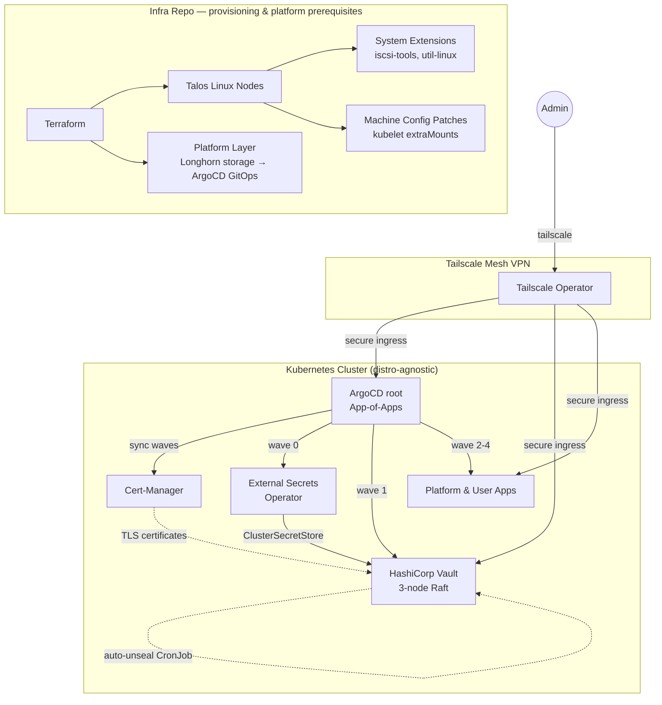

# Secured GitOps Homelab

[-blue?style=for-the-badge&logo=kubernetes)](https://kubernetes.io/)
[](https://argoproj.github.io/cd/)
[](https://www.vaultproject.io/)
[](https://tailscale.com/)
[](https://github.com/Seom88/infra-talos-homelab)

> **Companion project:** Cluster provisioning **and platform prerequisites** (Longhorn storage → ArgoCD GitOps) at
> [`github.com/Seom88/infra-talos-homelab`](https://github.com/Seom88/infra-talos-homelab)

Enterprise-grade DevSecOps homelab that runs on **any CNCF-compliant Kubernetes cluster**, with Longhorn (storage) and ArgoCD (GitOps engine) provided as prerequisites by the companion infra repo.

## 🚀 Overview

Fully automated Kubernetes environment focused on **GitOps principles**, **Zero-Trust networking** via Tailscale, and **Advanced Secret Management** with Vault + External Secrets Operator.

The companion infra repo installs the platform prerequisites — Longhorn (storage) and ArgoCD (GitOps engine) via its `platform/` Terraform root — **before** this repo is bootstrapped. Everything else — Vault, cert-manager, External Secrets, monitoring, and the platform and user apps — is managed declaratively from this repo through an ArgoCD **App-of-Apps** pattern.

## 🏗 Architecture


```mermaid
graph TD
    subgraph "Infra Repo — provisioning & platform prerequisites"
        TF[Terraform]
        TALOS[Talos Linux Nodes]
        EXT[System Extensions<br/>iscsi-tools, util-linux]
        PATCH[Machine Config Patches<br/>kubelet extraMounts]
        PLATFORM[Platform Layer<br/>Longhorn storage → ArgoCD GitOps]
        TF --> TALOS
        TALOS --> EXT
        TALOS --> PATCH
        TF --> PLATFORM
    end

    subgraph "Tailscale Mesh VPN"
        TS[Tailscale Operator]
    end

    subgraph "Kubernetes Cluster (distro-agnostic)"
        direction TB
        ROOT[ArgoCD root<br/>App-of-Apps]
        Vault[HashiCorp Vault<br/>3-node Raft]
        ESO[External Secrets<br/>Operator]
        Cert[Cert-Manager]
        Apps[Platform & User Apps]

        ROOT -->|sync waves| Cert
        ROOT -->|wave 0| ESO
        ROOT -->|wave 1| Vault
        ROOT -->|wave 2-4| Apps
    end

    User((Admin)) -->|tailscale| TS
    TS -->|secure ingress| ROOT
    TS -->|secure ingress| Vault
    TS -->|secure ingress| Apps

    ESO -->|ClusterSecretStore| Vault
    Vault -.->|auto-unseal CronJob| Vault
    Cert -.->|TLS certificates| Vault
```

## 🛡 Key DevSecOps Features

- **GitOps Flow**: ArgoCD (installed by the infra platform layer) manages everything declaratively via App-of-Apps. The bootstrap script deploys the root app and configures Vault.
- **Cluster-Agnostic**: The GitOps layer runs on any Kubernetes distro — Talos in the companion repo, or any other CNCF-compliant distribution. Longhorn is required **before** ArgoCD because ArgoCD's HA `redis-ha` queue needs PVCs, and a bare cluster has no provisioner.
- **Zero-Trust Networking**: Tailscale operator provides secure ingress without exposing ports — every service gets a `.tailnet` domain.
- **Secrets Management**:
  - HashiCorp Vault (HA, 3-node Raft) with auto-unseal via CronJob
  - External Secrets Operator syncs Vault → native Kubernetes Secrets
  - Per-service ClusterSecretStores for least-privilege access
  - Secrets encryption at rest via KMS
- **Certificate Automation**: cert-manager issues and renews TLS certificates for Vault and cluster services.
- **Observability**: Prometheus + Grafana + Loki stack with Vault-injected credentials.
- **Architecture Decision Records**: ADRs document key decisions and their tradeoffs.

## 🛠 Tech Stack

| Category | Tool | Status |
|----------|------|--------|
| **Provisioning** | Terraform + Talos (`infra-talos-homelab`) | ✅ Companion repo (cluster + platform) |
| **Orchestration** | Kubernetes (distro-agnostic) | ✅ Prerequisites via infra |
| **GitOps** | ArgoCD | ✅ Prerequisite (installed by infra platform layer) |
| **Storage** | Longhorn | ✅ Prerequisite (default StorageClass + `longhorn-prod`) |
| **Secrets** | Vault (HA Raft) + ESO | ✅ Per-service stores |
| **Networking** | Tailscale Operator | ✅ Platform ingress templates |
| **Certificates** | cert-manager | ✅ Vault TLS |
| **Monitoring** | Prometheus + Grafana + Loki | ✅ Platform ingresses via Tailscale |
| **Object storage** | SeaweedFS | ✅ S3 with Vault-injected credentials |

## 🏁 Getting Started

This is the **GitOps layer** — it assumes a running cluster with Longhorn and ArgoCD already installed. Cluster provisioning and platform prerequisites are in the [infra repo](https://github.com/Seom88/infra-talos-homelab).

If you want to replicate or fork this lab:

1. **Ensure prerequisites**: Use a running Kubernetes cluster with **Longhorn** and **ArgoCD** pre-installed. The infra repo's `platform/` Terraform root provisions them in order (nodes ready → Longhorn → CSI ready → `longhorn-prod` StorageClass → ArgoCD) — run `just tf-platform-apply` there.
2. **Fork both repos** — Update repository references (including the infra repo's platform layer) in the [Customization Guide](docs/customization-guide.md).
3. **Bootstrap**: Run `just init-prod` or `just init-dev` (or `./bootstrap/01-init-gitops.sh [prod|dev]`), which deploys the root App-of-Apps and configures Vault. It no longer installs ArgoCD or any storage component.

## 📂 Project Structure

```
secured-gitops-tailscale-homelab/
├── bootstrap/                   # One-shot init scripts
│   └── 01-init-gitops.sh        # Deploys root App-of-Apps & configures Vault
│
├── platform/                    # Platform-level Helm charts
│   ├── vault/                   # Vault HA chart + auto-unseal + ESO configs
│   ├── monitoring/              # Prometheus / Grafana / Loki stack
│   ├── tailscale/               # Tailscale operator + ingress templates
│   └── seaweedfs/               # S3-compatible object storage
│
├── apps/                        # User-facing applications
│   └── template-pod-tailscale/  # Reusable template: deploy + service + ingress
│
├── gitops/                      # Root "App of Apps" Helm chart
│   ├── Chart.yaml               # Meta-chart orchestrating everything
│   ├── values.yaml              # Production values
│   ├── values-dev.yaml          # Dev overrides (branch: dev)
│   └── templates/               # ApplicationSets & root app
│
├── docs/                        # Documentation & ADRs
│   ├── getting-started.md       # Full walkthrough
│   ├── customization-guide.md   # Fork adaptation guide
│   ├── secrets-structure.md     # Vault secret organization
│   └── adrs/                    # Architecture Decision Records
│
└── justfile                     # Dev recipes for cluster management
```

## 📈 Roadmap

### Phase 1 — Foundation ✅
- [X] Bootstrap script: root App-of-Apps → Vault → apps
- [X] ArgoCD with HA config and custom health probes
- [X] Vault HA (3-node Raft) with TLS + auto-unseal + ESO integration
- [X] Cert-Manager for automated TLS
- [X] External Secrets Operator with per-service ClusterSecretStores
- [X] Tailscale operator with platform ingress templates
- [X] Longhorn + ArgoCD moved to infra repo platform layer (prerequisites)
- [X] Architecture Decision Records

### Phase 2 — Automation & Observability 🚧
- [X] Monitoring stack — Prometheus + Grafana + Loki deployed
- [X] Prometheus / Grafana ingresses enabled via Tailscale
- [ ] Renovate bot

### Phase 3 — Storage & Scale 📋
- [X] Longhorn — distributed block storage (prerequisite, from the infra repo)
- [X] SeaweedFS — S3-compatible object storage
- [ ] Velero — cluster backups to SeaweedFS

### Phase 4 — Hardening & Developer Experience 💡
- [ ] CI/CD Pipeline — GitHub Actions for lint, test, preview
- [ ] Real application deployment (Immich or similar)

---

## 🔗 Related Projects

| Repo | Role |
|------|------|
| [`infra-talos-homelab`](https://github.com/Seom88/infra-talos-homelab) | Cluster provisioning + platform prerequisites (Longhorn, ArgoCD) — Terraform + Talos |
| `secured-gitops-tailscale-homelab` _(this repo)_ | GitOps layer — Vault, Tailscale, storage apps (consumes Longhorn + ArgoCD from infra) |

*Built for learning, security, and automation.*