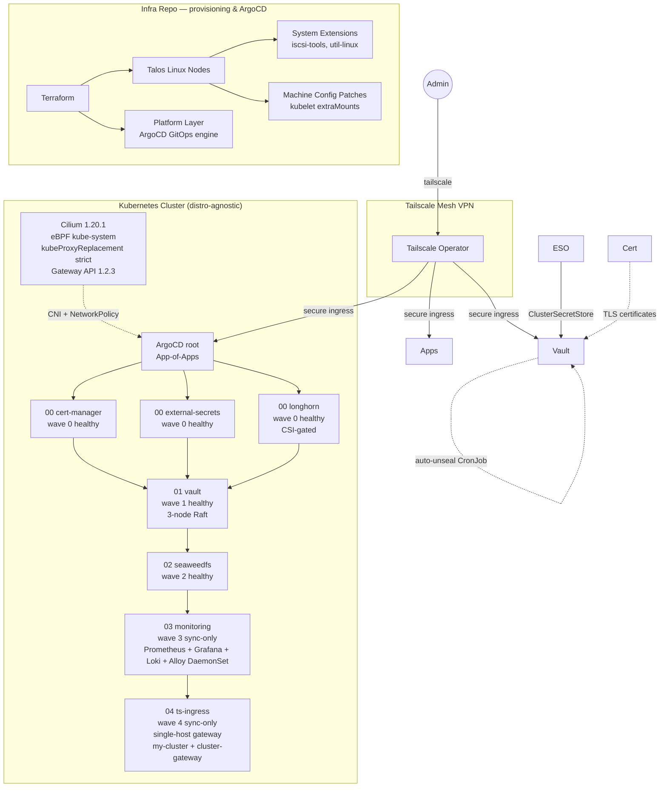

# Secured GitOps Homelab

[-blue?style=for-the-badge&logo=kubernetes)](https://kubernetes.io/)
[](https://argoproj.github.io/cd/)
[](https://www.vaultproject.io/)
[](https://tailscale.com/)
[](https://github.com/Seom88/infra-talos-homelab)

[](https://github.com/Seom88/secured-gitops-tailscale-homelab/releases)
[](https://github.com/Seom88/secured-gitops-tailscale-homelab/actions)
[](https://github.com/Seom88/secured-gitops-tailscale-homelab/commits)
[](LICENSE)
[](#-roadmap)

> **Companion project:** Cluster provisioning + ArgoCD (GitOps engine) + Longhorn node prerequisites at
> [`github.com/Seom88/infra-talos-homelab`](https://github.com/Seom88/infra-talos-homelab)

Production-grade **GitOps reference implementation** that demonstrates enterprise DevSecOps patterns on any CNCF-compliant Kubernetes cluster. Combines infrastructure-as-code (companion repo), zero-trust networking (Tailscale), secrets management at scale (Vault HA), and declarative deployments (ArgoCD).

## � Quick Navigation

- [Why This Matters](#-why-this-matters) — Career relevance for recruiters
- [Skills Demonstrated](#-skills-demonstrated) — What this proves you can build
- [Highlights](#-highlights) — Key features at a glance
- [Architecture](#-architecture) — System design
- [Quick Start](#-quick-start) — Get up and running
- [Roadmap](#-roadmap) — Phases and progress
- [Contributing](#-contributing) — How to participate
- **Deep Dives:** [Features](./docs/features-deep-dive.md) · [Getting Started](./docs/getting-started.md) · [Customization](./docs/customization-guide.md)

---

## 💡 Why This Matters

This is **not just another Kubernetes homelab** — it's a reference implementation that demonstrates:

- **Production-grade architecture** — How real DevSecOps teams build secure, scalable systems
- **Enterprise patterns** — Vault HA for secrets, ArgoCD for GitOps, zero-trust networking via Tailscale
- **Hands-on learning** — Understand distributed systems, Kubernetes operations, and infrastructure automation by running real workloads
- **Career value** — Portfolio that shows you can architect and operate enterprise platforms

**For recruiters:** This demonstrates the ability to design multi-layer systems, understand security fundamentals, and implement industry best practices.

**For your learning:** Fork it, modify it, deploy it — understand production systems by building and troubleshooting them.

---

## 🎓 Skills Demonstrated

| Area | What This Proves | See Also |
|------|------------------|----------|
| **Secrets Management** | Vault HA (3-node Raft), auto-unseal, per-service auth | [`platform/vault/`](./platform/vault/), [Docs](./docs/skills-demonstrated.md#-secrets-management--security) |
| **GitOps & Orchestration** | ArgoCD App-of-Apps, sync-wave ordering, custom health checks | [`gitops/templates/apps/`](./gitops/templates/apps/), [ADR-006](./docs/adrs/006-app-health-and-vault-ordering.md) |
| **Zero-Trust Networking** | Tailscale operator, single-host gateway (`my-cluster.lonk-mirfak.ts.net` + path routing) — 1 device | [`platform/ts-ingress/`](./platform/ts-ingress/), [ADR-001](./docs/adrs/001-tailscale-ingress-placement.md), [ADR-012](./docs/adrs/012-single-host-cluster-gateway.md) |
| **High-Availability** | Vault Raft quorum, multi-node Kubernetes, Longhorn distributed storage | [`platform/vault/templates/`](./platform/vault/templates/), [Features](./docs/features-deep-dive.md#-storage-longhorn--seaweedfs) |
| **Observability** | Prometheus + Grafana + Loki + Alloy (DaemonSet log collector) with Vault metrics | [`platform/monitoring/`](./platform/monitoring/) |
| **Storage & Data** | Longhorn CSI, SeaweedFS S3, persistent volume management | [`platform/seaweedfs/`](./platform/seaweedfs/), [ADR-005](./docs/adrs/005-longhorn-back-to-gitops.md) |
| **Infrastructure Automation** | Multi-environment Helm, validation blocks, CI/CD gates (companion repo) | Companion [`infra-talos-homelab`](https://github.com/Seom88/infra-talos-homelab) |
| **DevSecOps Mindset** | Architecture Decisions documented, roadmap planned, phases tracked | [Roadmap](./docs/roadmap.md), [ADRs](./docs/adrs/) |

**Full skill breakdown:** See [`docs/skills-demonstrated.md`](./docs/skills-demonstrated.md)

---

## ✨ Highlights

- 🔒 **Enterprise Security** — Vault HA with auto-unseal, zero-trust networking, per-service RBAC
- 🚀 **GitOps Native** — App-of-Apps pattern with wave-ordered dependencies and custom health checks
- 🌐 **Cluster-Agnostic** — Runs on any Kubernetes distro (Talos in companion repo, but works with others)
- ⚡ **Production-Ready Patterns** — Demonstrates how real platforms scale secrets, networking, and deployments
- 📊 **Complete Observability** — Prometheus metrics, Grafana dashboards, Loki log aggregation via Alloy (stateless DaemonSet)
- 📦 **Storage Ready** — Longhorn distributed storage + SeaweedFS S3 backend (Loki) / RustFS S3 (Velero)
- 🔄 **Idempotent Bootstrap** — Rerun scripts safely, designed for repeated deployments

## 🏗 Architecture


```mermaid
graph TD
    subgraph "Infra Repo — provisioning & ArgoCD"
        TF[Terraform]
        TALOS[Talos Linux Nodes]
        EXT[System Extensions<br/>iscsi-tools, util-linux]
        PATCH[Machine Config Patches<br/>kubelet extraMounts]
        PLATFORM[Platform Layer<br/>ArgoCD GitOps engine]
        TF --> TALOS
        TALOS --> EXT
        TALOS --> PATCH
        TF --> PLATFORM
    end

    subgraph "Tailscale Mesh VPN"
        TS[Tailscale Operator]
    end

    subgraph "Kubernetes Cluster (distro-agnostic)"
        direction TB
        CILIUM[Cilium 1.20.1<br/>eBPF kube-system<br/>kubeProxyReplacement strict<br/>Gateway API 1.2.3]
        ROOT[ArgoCD root<br/>App-of-Apps]
        W0A[00 cert-manager<br/>wave 0 healthy]
        W0B[00 external-secrets<br/>wave 0 healthy]
        W0C[00 longhorn<br/>wave 0 healthy<br/>CSI-gated]
        W1[01 vault<br/>wave 1 healthy<br/>3-node Raft]
        W2[02 seaweedfs<br/>wave 2 healthy]
        W3[03 monitoring<br/>wave 3 sync-only<br/>Prometheus + Grafana + Loki + Alloy DaemonSet]
        W4[04 ts-ingress<br/>wave 4 sync-only<br/>single-host gateway<br/>my-cluster + cluster-gateway]

        CILIUM -.->|CNI + NetworkPolicy| ROOT
        ROOT --> W0A & W0B & W0C
        W0A & W0B & W0C --> W1
        W1 --> W2
        W2 --> W3
        W3 --> W4
    end

    User((Admin)) -->|tailscale| TS
    TS -->|secure ingress| ROOT
    TS -->|secure ingress| Vault
    TS -->|secure ingress| Apps

    ESO -->|ClusterSecretStore| Vault
    Vault -.->|auto-unseal CronJob| Vault
    Cert -.->|TLS certificates| Vault
```

> Cilium CNI + identity-aware policies: see [ADR-014](./docs/adrs/014-cilium-cni-and-identity-networkpolicies.md) and [Networking](./docs/networking.md).

## 🛡 Key DevSecOps Features

- **GitOps Automation** — ArgoCD (installed by the infra repo) manages everything declaratively via App-of-Apps. The bootstrap script deploys the root app and configures Vault in one idempotent step.
- **Cluster-Agnostic Platform** — This layer runs on any Kubernetes distro. Talos Linux in the companion repo, but works with EKS, GKE, or any CNCF cluster once ArgoCD is pre-installed.
- **Zero-Trust Networking** — Tailscale operator provides single-host secure ingress (`my-cluster.lonk-mirfak.ts.net/{argocd,grafana,prometheus,vault,longhorn,seaweedfs-*}` via in-namespace `cluster-gateway` NGINX) — 1 MagicDNS device, 1 cert. Every admin access goes through Tailscale mesh VPN. See [ADR-012](./docs/adrs/012-single-host-cluster-gateway.md).
- **Enterprise Secrets Management** — Vault HA (3-node Raft) with auto-unseal, External Secrets Operator syncs to native K8s Secrets, per-service ClusterSecretStores for least-privilege access.
- **Distributed Storage** — Longhorn CSI (wave-0) provides persistent volumes; SeaweedFS adds S3-compatible object storage for logs and backups.
- **Complete Observability** — Prometheus + Grafana + Loki + Alloy stack with Vault, ArgoCD, and cluster metrics (Alloy DaemonSet ships pod logs via `loki.source.kubernetes` → `loki.write` to Loki gateway). All dashboards secured behind Tailscale.
- **Declarative Everything** — Infrastructure, secrets, applications — all defined in git, no imperative commands. Audit trail for compliance.

**For technical deep-dives:** See [`docs/features-deep-dive.md`](./docs/features-deep-dive.md)

## 🛠 Tech Stack

| Layer | Component | Status | Notes |
|-------|-----------|--------|-------|
| **Orchestration** | Kubernetes (any distro) | ✅ Ready | Talos Linux in companion repo |
| **GitOps Engine** | ArgoCD v2.8+ | ✅ Ready | Installed by companion infra layer |
| **Secrets** | Vault v1.15+ (HA Raft) | ✅ Deployed | 3-node cluster with auto-unseal |
| **Secrets Sync** | External Secrets Operator | ✅ Deployed | Per-service ClusterSecretStores |
| **Certificates** | cert-manager v1.13+ | ✅ Deployed | Automated TLS for services |
| **Networking (CNI)** | Cilium v1.20.1 (eBPF) | ✅ Deployed | Kube-proxy replacement, Gateway API & CiliumNetworkPolicy |
| **Networking (Ingress)** | Tailscale Operator v1.9+ | ✅ Deployed | Zero-trust ingress (`.tailnet` domains) |
| **Storage (Block)** | Longhorn v1.6+ | ✅ Deployed | Distributed, wave-0 with CSI gates |
| **Storage (Object)** | SeaweedFS v3.6+ | ✅ Deployed | S3-compatible, Loki backend |
| **Monitoring** | Prometheus v2.45+, Grafana v10+, Loki v2.9+ + Alloy chart 1.12.1 | ✅ Deployed | Full observability stack (Prometheus + Grafana + Loki + Alloy DaemonSet) |
| **Backups** | Velero v1.18.1 (chart 12.1.0) | ✅ Deployed | Wave 0, RustFS S3 (`velero-homelab`), daily + hourly schedules |
| **Python Automation** | Typer CLI, pytest, Trivy | 🚧 Phase 5 | Post-v1.0 release (v2.0 roadmap) |

---

## 🏁 Getting Started

This is the **GitOps layer** — it assumes a running cluster with ArgoCD already installed via the companion `infra-talos-homelab` repo's platform layer.

### System Requirements

- **Kubernetes 1.27+** (any CNCF-compliant distribution)
- **ArgoCD 2.8+** (pre-installed on cluster)
- **kubectl** and **helm 3.12+**
- **just** (task runner) — [install](https://github.com/casey/just)
- **Tailscale account** (free tier supported) — for secure ingress

### Prerequisites

1. Ensure you have a running Kubernetes cluster with **ArgoCD installed** as the platform layer
   - If using companion repo: Run `just tf-platform-apply` in `infra-talos-homelab` first
2. Cluster networking configured (Tailscale subnet router set up for secure access)
3. `kubeconfig` available locally

### Quick Setup

```bash
# 1. Fork/clone both repos and update repository references
git clone https://github.com/YOUR_USERNAME/secured-gitops-tailscale-homelab.git
cd secured-gitops-tailscale-homelab

# 2. Bootstrap the GitOps layer (deploys root App-of-Apps + configures Vault)
./bootstrap/init-gitops.sh prod

# 3. Verify deployment (watch apps come online)
kubectl get applications -n argocd
just status

# 4. Access dashboards
# Grafana, Prometheus, Vault UI all available via Tailscale
# Use port-forward for local access:
kubectl port-forward -n monitoring svc/grafana 3000:80
```

**Full walkthrough:** See [`docs/getting-started.md`](./docs/getting-started.md)  
**Customization:** See [`docs/customization-guide.md`](./docs/customization-guide.md)

## 📂 Project Structure

```
secured-gitops-tailscale-homelab/
├── bootstrap/               # Bootstrap script (init-gitops.sh)
├── platform/                # Helm charts (Vault, Monitoring, Tailscale, SeaweedFS)
├── gitops/                  # Root App-of-Apps (wave-ordered deployments)
├── apps/                    # User application templates
├── docs/                    # Documentation, ADRs, guides
├── .github/workflows/       # CI/CD pipelines
├── renovate.json            # Dependency update automation
├── justfile                 # Task automation
└── README.md               # This file
```

**Key files:**
- `bootstrap/init-gitops.sh` — Idempotent bootstrap script
- `gitops/Chart.yaml` — Root App-of-Apps meta-chart
- `gitops/templates/apps/` — Platform apps ordered by sync-wave
- `platform/vault/` → `platform/ts-ingress/` → ... — Individual platform charts

**Full directory walkthrough:** See [`docs/getting-started.md`](./docs/getting-started.md)

## 📈 Roadmap

## 📈 Roadmap & Status

**Current Version:** v1.0-beta · **Status:** Actively Maintained · **Last Update:** August 2026

| Phase | Status | Highlights |
|-------|--------|----------|
| **Phase 1** — Foundation | ✅ Complete | Bootstrap, ArgoCD, Vault HA, cert-manager, Tailscale, ADRs |
| **Phase 2** — Automation & Observability | ✅ Complete | Prometheus + Grafana + Loki + Alloy (DaemonSet), Renovate, CI/CD gates |
| **Phase 3** — Storage & Scale | ✅ Complete | Longhorn ✅, SeaweedFS ✅ (Loki), Velero ✅ (RustFS, Wave 0) |
| **Phase 4** — Hardening & DX | 🟡 Partial | Bootstrap guard ✅, status verifier ✅, real app example (pending) |
| **Phase 5** — Python Automation | 🚧 Planned | Post-v1.0: ops CLI, tests, metrics, image scanning |

**Full roadmap with Phase 5 vision:** See [`docs/roadmap.md`](./docs/roadmap.md)

**v1.0 Release Target:** Q1 2026 (Phases 1-4 complete)  
**v2.0 Roadmap:** Python ops layer (Phase 5) post-v1.0

---

## 🤝 Contributing & Collaboration

This project is actively maintained and open to contributions.

### Get Involved

- 🐛 **Found a bug?** → [GitHub Issues](https://github.com/Seom88/secured-gitops-tailscale-homelab/issues)
- ✨ **Have an idea?** → [GitHub Discussions](https://github.com/Seom88/secured-gitops-tailscale-homelab/discussions)
- 📝 **Want to contribute?** → See [CONTRIBUTING.md](./CONTRIBUTING.md) for guidelines
- 🏗️ **Architectural proposals?** → Open a PR with an ADR in [`docs/adrs/`](./docs/adrs/)

### For Recruiters & Team Leads

If you're evaluating DevOps/Platform Engineering talent:

- **Portfolio Evidence:** This repo demonstrates [these specific skills](./docs/skills-demonstrated.md)
- **Technical Communication:** See [ADRs](./docs/adrs/) for architectural thinking
- **Real-World Patterns:** Production-grade implementations, not toy examples
- **Contact:** Connect via [GitHub Profile](https://github.com/Seom88)

---

## 🔗 Related Projects

| Repo | Role |
|------|------|
| [`infra-talos-homelab`](https://github.com/Seom88/infra-talos-homelab) | Cluster provisioning + ArgoCD engine — Terraform + Talos (Longhorn node prerequisites stay here) |
| `secured-gitops-tailscale-homelab` _(this repo)_ | GitOps layer — Vault, Tailscale, storage apps (deploys Longhorn as a wave-0 app) |

---

## 📚 Documentation

- **[Getting Started](./docs/getting-started.md)** — End-to-end bootstrap walkthrough
- **[Customization Guide](./docs/customization-guide.md)** — Forking and adapting the project
- **[Architecture](./docs/architecture.md)** — System design and component interactions
- **[Features Deep Dive](./docs/features-deep-dive.md)** — Detailed explanations of each feature
- **[Skills Demonstrated](./docs/skills-demonstrated.md)** — What this proves you can build
- **[Roadmap](./docs/roadmap.md)** — Phases, status, and v2.0 vision
- **[Architecture Decision Records](./docs/adrs/)** — Why key decisions were made
- **[Secrets Structure](./docs/secrets-structure.md)** — Vault secret organization

---

**Built for learning, production patterns, and DevSecOps career growth.** ⭐ If this helps you, please consider starring the repo!