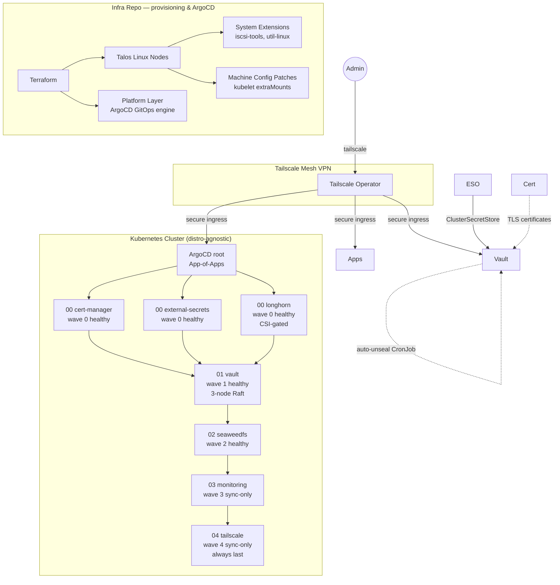

# Secured GitOps Homelab

[-blue?style=for-the-badge&logo=kubernetes)](https://kubernetes.io/)
[](https://argoproj.github.io/cd/)
[](https://www.vaultproject.io/)
[](https://tailscale.com/)
[](https://github.com/Seom88/infra-talos-homelab)

> **Companion project:** Cluster provisioning + ArgoCD (GitOps engine) + Longhorn node prerequisites at
> [`github.com/Seom88/infra-talos-homelab`](https://github.com/Seom88/infra-talos-homelab)

Enterprise-grade DevSecOps homelab that runs on **any CNCF-compliant Kubernetes cluster**, with ArgoCD (GitOps engine) installed by the companion infra repo and Longhorn (storage) deployed from this repo as a wave-0 platform app.

## 🚀 Overview

Fully automated Kubernetes environment focused on **GitOps principles**, **Zero-Trust networking** via Tailscale, and **Advanced Secret Management** with Vault + External Secrets Operator.

The companion infra repo installs ArgoCD (GitOps engine) via its `platform/` Terraform root — **before** this repo is bootstrapped. Longhorn (storage) is also managed declaratively from this repo as a wave-0 platform app with a CSI readiness gate. Everything else — Vault, cert-manager, External Secrets, monitoring, and the platform and user apps — is managed declaratively from this repo through an ArgoCD **App-of-Apps** pattern. Platform apps are plain `Application` resources in `gitops/templates/apps/` with a `00-` prefix and `argocd.argoproj.io/sync-wave` annotations (not ApplicationSets), ordered deterministically via a custom Application health check.

## 🏗 Architecture


```mermaid
graph TD
    subgraph "Infra Repo — provisioning & ArgoCD"
        TF[Terraform]
        TALOS[Talos Linux Nodes]
        EXT[System Extensions<br/>iscsi-tools, util-linux]
        PATCH[Machine Config Patches<br/>kubelet extraMounts]
        PLATFORM[Platform Layer<br/>ArgoCD GitOps engine]
        TF --> TALOS
        TALOS --> EXT
        TALOS --> PATCH
        TF --> PLATFORM
    end

    subgraph "Tailscale Mesh VPN"
        TS[Tailscale Operator]
    end

    subgraph "Kubernetes Cluster (distro-agnostic)"
        direction TB
        ROOT[ArgoCD root<br/>App-of-Apps]
        W0A[00 cert-manager<br/>wave 0 healthy]
        W0B[00 external-secrets<br/>wave 0 healthy]
        W0C[00 longhorn<br/>wave 0 healthy<br/>CSI-gated]
        W1[01 vault<br/>wave 1 healthy<br/>3-node Raft]
        W2[02 seaweedfs<br/>wave 2 healthy]
        W3[03 monitoring<br/>wave 3 sync-only]
        W4[04 tailscale<br/>wave 4 sync-only<br/>always last]

        ROOT --> W0A & W0B & W0C
        W0A & W0B & W0C --> W1
        W1 --> W2
        W2 --> W3
        W3 --> W4
    end

    User((Admin)) -->|tailscale| TS
    TS -->|secure ingress| ROOT
    TS -->|secure ingress| Vault
    TS -->|secure ingress| Apps

    ESO -->|ClusterSecretStore| Vault
    Vault -.->|auto-unseal CronJob| Vault
    Cert -.->|TLS certificates| Vault
```

## 🛡 Key DevSecOps Features

- **GitOps Flow**: ArgoCD (installed by the infra platform layer) manages everything declaratively via App-of-Apps. The bootstrap script deploys the root app and configures Vault.
- **Cluster-Agnostic**: The GitOps layer runs on any Kubernetes distro — Talos in the companion repo, or any other CNCF-compliant distribution. ArgoCD, and the storage→apps ordering is expressed as declarative sync waves plus the Longhorn CSI readiness gate.
- **Zero-Trust Networking**: Tailscale operator provides secure ingress without exposing ports — every service gets a `.tailnet` domain.
- **Secrets Management**:
  - HashiCorp Vault (HA, 3-node Raft) with auto-unseal via CronJob
  - External Secrets Operator syncs Vault → native Kubernetes Secrets
  - Per-service ClusterSecretStores for least-privilege access
  - Secrets encryption at rest via KMS
- **Certificate Automation**: cert-manager issues and renews TLS certificates for Vault and cluster services.
- **Observability**: Prometheus + Grafana + Loki stack with Vault-injected credentials.
- **Architecture Decision Records**: ADRs document key decisions and their tradeoffs.

## 🛠 Tech Stack

| Category | Tool | Status |
|----------|------|--------|
| **Provisioning** | Terraform + Talos (`infra-talos-homelab`) | ✅ Companion repo (cluster + platform) |
| **Orchestration** | Kubernetes (distro-agnostic) | ✅ Prerequisites via infra |
| **GitOps** | ArgoCD | ✅ Prerequisite (installed by infra platform layer) |
| **Storage** | Longhorn | ✅ Managed by this repo (wave-0 app) |
| **Secrets** | Vault (HA Raft) + ESO | ✅ Per-service stores |
| **Networking** | Tailscale Operator | ✅ Platform ingress templates |
| **Certificates** | cert-manager | ✅ Vault TLS |
| **Monitoring** | Prometheus + Grafana + Loki | ✅ Platform ingresses via Tailscale |
| **Object storage** | SeaweedFS | ✅ S3 with Vault-injected credentials |
| **Python tooling** | Typer ops CLI · pytest/testinfra · prometheus_client · Trivy scan | 🚧 Phase 5 (planned) |

## 🐍 Python Tooling

Python powers the **operational layer** around the declarative core: the manifests stay YAML/Helm, while Python carries the automation, validation, and security checks that fragile shell scripts do poorly.

| Area | Stack | Why it matters |
|------|-------|----------------|
| **Ops CLI** | `typer` + `kubernetes` + `hvac` | Replaces fragile bootstrap shell scripts with a testable CLI: bootstrap, health checks, port-forward, cluster doctor |
| **Infrastructure tests** | `pytest` + `testinfra` | Proves cluster state after bootstrap: Vault unsealed, ArgoCD Apps healthy, secrets synced — CI-ready validation |
| **Observability exporter** | `prometheus_client` | Custom metrics the stack doesn't ship: Vault sealed state, ArgoCD app health/drift — ready for Grafana dashboards |
| **Maintenance automation** | `hvac` + `kubernetes` | Secret rotation, Longhorn snapshot cleanup, Velero backup health |
| **Image security validation** | Trivy orchestration | Scans every image referenced in the charts/manifests and gates on critical vulnerabilities — DevSecOps hardening |

All areas are planned (not yet implemented) — see [Phase 5 in the Roadmap](#-roadmap).

## 🏁 Getting Started

This is the **GitOps layer** — it assumes a running cluster with ArgoCD already installed via the infra repo's platform layer. Storage is not a prerequisite anymore: this repo deploys Longhorn as a wave-0 platform app.

If you want to replicate or fork this lab:

1. **Ensure prerequisites**: Use a running Kubernetes cluster with **ArgoCD** installed. The infra repo's `platform/` Terraform root provisions it (nodes ready → ArgoCD) — run `just tf-platform-apply` there. Longhorn is deployed by this repo as wave 0 during bootstrap.
2. **Fork both repos** — Update repository references (including the infra repo's platform layer) in the [Customization Guide](docs/customization-guide.md).
3. **Bootstrap**: Run `just init-prod` or `just init-dev` (or `./bootstrap/init-gitops.sh [prod|dev]`), which deploys the root App-of-Apps — including Longhorn as wave 0 — and configures Vault. It does not install ArgoCD or any storage component. The script checks if the App-of-Apps already exists and skips reapply (idempotent); a second run acts as a status verifier showing ArgoCD Applications / pods coming up. Use `--force` (`just init-prod-force` / `./bootstrap/init-gitops.sh prod --force`) to reapply.

## 📂 Project Structure

```
secured-gitops-tailscale-homelab/
├── bootstrap/                   # One-shot init scripts
│   └── init-gitops.sh           # Deploys root App-of-Apps & configures Vault (idempotent, rerun for status)
│
├── platform/                    # Platform-level Helm charts
│   ├── vault/                   # Vault HA chart + auto-unseal + ESO configs
│   ├── monitoring/              # Prometheus / Grafana / Loki stack
│   ├── tailscale/               # Tailscale operator + ingress templates
│   └── seaweedfs/               # S3-compatible object storage
│
├── apps/                        # User-facing applications
│   └── template-pod-tailscale/  # Reusable template: deploy + service + ingress
│
├── gitops/                      # Root "App of Apps" Helm chart
│   ├── Chart.yaml               # Meta-chart orchestrating everything
│   ├── values.yaml              # Production values
│   ├── values-dev.yaml          # Dev overrides (branch: dev)
│   └── templates/
│       ├── root-prod-app.yaml   # Root App-of-Apps (points at ./gitops)
│       └── apps/                # Plain Applications ordered by sync-wave
│           ├── 00-cert-manager.yaml      # wave 0 (healthy)
│           ├── 00-external-secrets.yaml  # wave 0 (healthy)
│           ├── 00-longhorn.yaml          # wave 0 (healthy, CSI-gated)
│           ├── 01-vault.yaml             # wave 1 (healthy)
│           ├── 02-seaweedfs.yaml         # wave 2 (healthy)
│           ├── 03-monitoring.yaml        # wave 3 (sync-only leaf)
│           └── 04-tailscale.yaml         # wave 4 (sync-only, always last)
│
├── docs/                        # Documentation & ADRs
│   ├── getting-started.md       # Full walkthrough
│   ├── customization-guide.md   # Fork adaptation guide
│   ├── secrets-structure.md     # Vault secret organization
│   └── adrs/                    # Architecture Decision Records
│
└── justfile                     # Dev recipes for cluster management
```

## 📈 Roadmap

### Phase 1 — Foundation ✅
- [X] Bootstrap script: root App-of-Apps → Vault → apps
- [X] ArgoCD with HA config and custom health probes
- [X] Vault HA (3-node Raft) with TLS + auto-unseal + ESO integration
- [X] Cert-Manager for automated TLS
- [X] External Secrets Operator with per-service ClusterSecretStores
- [X] Tailscale operator with platform ingress templates
- [X] ArgoCD moved to infra repo platform layer; Longhorn back as a wave-0 GitOps app (ADR-005)
- [X] Architecture Decision Records

### Phase 2 — Automation & Observability 🚧
- [X] Monitoring stack — Prometheus + Grafana + Loki deployed
- [X] Prometheus / Grafana ingresses enabled via Tailscale
- [ ] Renovate bot

### Phase 3 — Storage & Scale 📋
- [X] Longhorn — distributed block storage (app, deployed by this repo)
- [X] SeaweedFS — S3-compatible object storage
- [ ] Velero — cluster backups to SeaweedFS

### Phase 4 — Hardening & Developer Experience 💡
- [X] CI/CD Pipeline — GitHub Actions for lint, test, preview (validate + guarded deploy, `just validate` local mirror)
- [ ] Real application deployment (Immich or similar)

> Phase 4 partially completed — bootstrap guard (`--force`), status verifier, CI workflow (validate + guarded deploy) and local `just validate` mirror.

### Phase 5 — Python Automation & Image Security 🚧
- [ ] Ops CLI: bootstrap, health checks, cluster doctor — replaces fragile bash (`typer` + `kubernetes` + `hvac`)
- [ ] Infrastructure tests: `pytest` + `testinfra` validation of Vault / ArgoCD / secrets state
- [ ] Prometheus exporter: Vault sealed state, ArgoCD app health & drift metrics (`prometheus_client`)
- [ ] Maintenance automation: secret rotation, Longhorn snapshots, Velero backups (`hvac` + `kubernetes`)
- [ ] Image security scanning: Trivy-based scan of chart images, gate on criticals

---

## 🔗 Related Projects

| Repo | Role |
|------|------|
| [`infra-talos-homelab`](https://github.com/Seom88/infra-talos-homelab) | Cluster provisioning + ArgoCD engine — Terraform + Talos (Longhorn node prerequisites stay here) |
| `secured-gitops-tailscale-homelab` _(this repo)_ | GitOps layer — Vault, Tailscale, storage apps (deploys Longhorn as a wave-0 app) |

*Built for learning, security, and automation.*