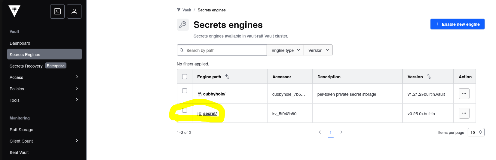
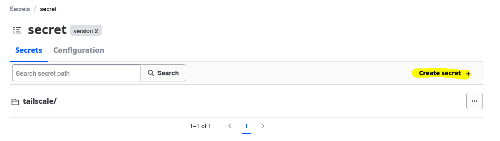
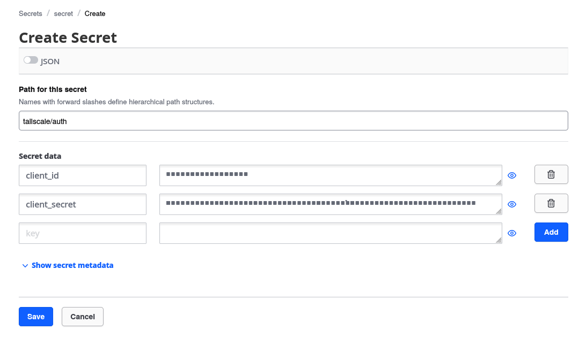

# Secrets Structure

This document describes the secrets required by applications in this homelab setup.

## Enable Secrets Engine (KV v2)

Before creating secrets, ensure the KV v2 secrets engine is enabled at path `secret`:

1. Go to **Secrets Engines** in Vault UI
2. Enable **KV** at path `secret`
3. Select version 2

## Tailscale OAuth Secret

**Path in Vault**: `secret/tailscale/auth`

**Required Keys**:
| Key | Description |
|-----|-------------|
| `client_id` | Tailscale OAuth client ID |
| `client_secret` | Tailscale OAuth client secret |

**How to Create**:

1. Open Vault UI at your Vault address
2. Navigate to **Secrets** → **secret/**

3. Click **Create secret**

4. Set path to `tailscale/auth`
5. Add the keys listed above with your actual values

**Why This Exists**:

This secret is used by the Tailscale Operator to authenticate with Tailscale's API. The External Secrets Operator (ESO) syncs this secret from Vault to Kubernetes, making it available as a standard Kubernetes secret named `operator-oauth` in the `tailscale` namespace.

## Other Secrets

Additional secrets can be added following this pattern:
- Create them in Vault UI under the `secret/` path
- ESO will automatically sync secrets that have a corresponding `ExternalSecret` resource defined in the cluster