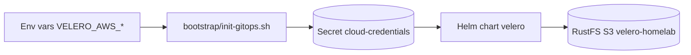

# Velero + RustFS — Backup & Restore

> **Stack:** Velero `1.18.1` (chart `12.1.0` via `vmware-tanzu/velero`) → RustFS S3 `velero-homelab` (`https://rustfs.lonk-mirfak.ts.net`) · **Namespace:** `velero` · **Wave:** `0` · **Status:** ✅ Deployed (not planned — see [README Tech Stack](../README.md#🛠-tech-stack))
>
> Loki also uses S3 but on a **different backend** — Loki → SeaweedFS (`seaweedfs-s3.seaweedfs:8333`, buckets `loki-chunks`/`loki-ruler`), Velero → RustFS (`rustfs.lonk-mirfak.ts.net`, bucket `velero-homelab`). Both are S3-compatible, but they are separate stores.

## 1. Why a bootstrap Secret

Velero backs up cluster manifests and workload data — but explicitly NOT Vault (see 8). If Velero's S3 credentials came from Vault via ExternalSecrets, a bare-metal restore deadlocks. The fix (ADR-004 option A) is a plain Secret created before ArgoCD syncs, referenced via `credentials.existingSecret: cloud-credentials`.

## 2. Flow



| Wave | Apps | Notes |
|------|------|-------|
| `-1` | `ts-operator` | Must be Healthy first — provides MagicDNS |
| `0` | `coredns-patch`, `velero`, `longhorn` | Storage and DNS ready before Vault |
| `1` | `vault` | Depends on Longhorn PVCs |

`coredns-patch` installs a `ts.net:53` stub so `rustfs.lonk-mirfak.ts.net` resolves inside the cluster.

## 3. Bucket creation

Automated via `templates/job-bucket-init.yaml` — an ArgoCD `Sync` hook (wave `0`) that runs after `ts-operator` is Healthy:

- Resolves `rustfs.lonk-mirfak.ts.net` via CoreDNS (120s wait), mounts `cloud-credentials`, and runs `aws s3api create-bucket` / `head-bucket` idempotently.
- Uses `amazon/aws-cli:2.15.0`, `dnsPolicy: ClusterFirst`, `AWS_S3_ADDRESSING_STYLE=path`.

Fallback manual:

```bash
aws s3api create-bucket --bucket velero-homelab --endpoint-url https://rustfs.lonk-mirfak.ts.net --region us-east-1
```

## 4. Secrets

Resolution order in `ensureVeleroCredentials()`:

1. `VELERO_AWS_ACCESS_KEY_ID` / `VELERO_AWS_SECRET_ACCESS_KEY` (preferred)
2. Fallback `AWS_ACCESS_KEY_ID` / `AWS_SECRET_ACCESS_KEY` (shared with Terraform)

```bash
VELERO_AWS_ACCESS_KEY_ID=... VELERO_AWS_SECRET_ACCESS_KEY=... ./bootstrap/init-gitops.sh prod
kubectl -n velero get secret cloud-credentials -o jsonpath='{.data.cloud}' | base64 -d
```

In CI, `.github/workflows/deploy.yaml` already injects `AWS_*`; optional `VELERO_AWS_*` repo secrets can be added for separation.

## 4b. Endpoint ConfigMap (CI-owned)

The informational ConfigMap `velero/s3-endpoint` (`tailnet-fqdn`, `s3-url`, `bucket`, `region`) is created by the `Ensure Velero S3 ConfigMap` step in `.github/workflows/deploy.yaml` from GitHub Vars `S3_ENDPOINT`. It is not templated by the chart — the chart only carries the URL-bearing manifests (Service, bucket-init Job, network policies, BackupStorageLocation) derived from `s3.tailnetFqdn`.

## 5. Verification

```bash
kubectl get applications -n argocd | grep -E 'velero|vault|longhorn'
kubectl -n velero get backupstoragelocations -o yaml  # phase: Ready
kubectl -n velero get pods -l app.kubernetes.io/name=velero
velero backup create manual-$(date +%Y%m%d%H%M) --wait && velero backup get
kubectl -n velero get schedules -o yaml
```

Schedules: `daily-full` (02:00, all namespaces except Vault/control-plane, 30d TTL). The former `vault-hourly` Velero schedule is retired (disabled) — hourly Vault protection is now a Longhorn local snapshot RecurringJob (see §8).

## 6. Troubleshooting

| Symptom | Fix |
|---------|-----|
| `cloud-credentials not found` | Re-run bootstrap with env vars |
| `NoSuchBucket` | Check `kubectl -n velero logs job/velero-bucket-init` |
| `BSL not Ready` | Verify `s3Url`/`s3ForcePathStyle` and ini format |
| `nslookup` fails | Check `kubectl -n kube-system get cm coredns | grep ts.net` |
| Velero OOMKilled | `resources.limits.memory` is pinned at `512Mi` (chart default `128Mi` OOMs on FsBackup); `deployNodeAgent: true` is required for `defaultVolumesToFsBackup: true` |

## 7. References

- ADR-004 option A, ADR-011 (DNS/NetworkPolicy)
- Chart: `platform/velero/Chart.yaml` (vmware-tanzu/velero `12.1.0`, app `1.18.1`, `deployNodeAgent: true`, memory limit `512Mi`) + `platform/velero/values.yaml` (schedule `daily-full` with `vault` excluded, RustFS `s3Url`/`s3ForcePathStyle`)
- BSL: single default location on RustFS (`s3://velero-homelab/velero/`, `s3ForcePathStyle: true`, `insecureSkipTLSVerify: true` for cluster-internal TLS)
- App: `gitops/templates/apps/05-velero.yaml` (sync-wave `0`, `wave-policy: healthy`, `CreateNamespace=true`)

## 8. Vault policy — excluded from Velero, re-bootstrap + rotation

Nothing of Vault is stored in Velero. `daily-full` lists `vault` in `excludedNamespaces`, and the old `vault-hourly` schedule is `disabled: true` (retained in `values.yaml` as documentation only).

Rationale: restoring Vault Raft state from a Velero backup corrupts the cluster (stale quorum/peers, sealed-state mismatch). Vault holds no irreplaceable PKI/transit material — everything it stores is regenerable — so DR is re-bootstrap, not restore:

```bash
./platform/vault/scripts/bootstrap-vault.sh   # init if initialized==false, unseal, kv-v2 + k8s auth
# then rotate secrets (ESO ClusterSecretStores re-sync from Vault)
```

Hourly crash-consistency for Vault volumes comes from Longhorn, not Velero: `platform/longhorn/templates/recurringjobs.yaml` defines a `RecurringJob` (`longhorn.io/v1beta2`, Longhorn chart `1.12.1` has no native `recurringJobs` values support, hence the raw CR):

| RecurringJob | Cron | Task | Retain | Group |
|--------------|------|------|--------|-------|
| `vault-hourly-snapshot` | `0 * * * *` | `snapshot` (local, NOT `backup`) | 24 (~1 day) | `vault-hourly` |

- `snapshot` vs `backup`: snapshots are local copy-on-write (instant, no target needed); `backup` requires an S3/NFS backup target, which is intentionally unconfigured in the Longhorn UI for now.
- Opt-in: label Vault volumes with `recurring-job-group.longhorn.io/vault-hourly=enabled` (Longhorn matches jobs to volumes by group). Commented-out daily snapshot templates for `seaweedfs`/`monitoring` are included in the same file for future use.
- Vault DR runbook: see `docs/runbook-vault-restore.md` (Raft snapshots are operational only — never the DR path).
