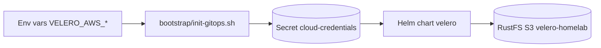

# Velero + RustFS — Backup & Restore

> **Stack:** Velero `9.0.2` → RustFS S3 `velero-homelab` (`https://rustfs.lonk-mirfak.ts.net`) · **Namespace:** `velero` · **Wave:** `0`

## 1. Why a bootstrap Secret

Velero backs up Vault. If Velero's S3 credentials came from Vault via ExternalSecrets, a bare-metal restore deadlocks. The fix (ADR-004 option A) is a plain Secret created before ArgoCD syncs, referenced via `credentials.existingSecret: cloud-credentials`.

## 2. Flow



| Wave | Apps | Notes |
|------|------|-------|
| `-1` | `tailscale-operator` | Must be Healthy first — provides MagicDNS |
| `0` | `coredns-patch`, `velero`, `longhorn` | Storage and DNS ready before Vault |
| `1` | `vault` | Depends on Longhorn PVCs |

`coredns-patch` installs a `ts.net:53` stub so `rustfs.lonk-mirfak.ts.net` resolves inside the cluster.

## 3. Bucket creation

Automated via `templates/job-bucket-init.yaml` — an ArgoCD `Sync` hook (wave `0`) that runs after `tailscale-operator` is Healthy:

- Resolves `rustfs.lonk-mirfak.ts.net` via CoreDNS (120s wait), mounts `cloud-credentials`, and runs `aws s3api create-bucket` / `head-bucket` idempotently.
- Uses `amazon/aws-cli:2.15.0`, `dnsPolicy: ClusterFirst`, `AWS_S3_ADDRESSING_STYLE=path`.

Fallback manual:

```bash
aws s3api create-bucket --bucket velero-homelab --endpoint-url https://rustfs.lonk-mirfak.ts.net --region us-east-1
```

## 4. Secrets

Resolution order in `ensureVeleroCredentials()`:

1. `VELERO_AWS_ACCESS_KEY_ID` / `VELERO_AWS_SECRET_ACCESS_KEY` (preferred)
2. Fallback `AWS_ACCESS_KEY_ID` / `AWS_SECRET_ACCESS_KEY` (shared with Terraform)

```bash
VELERO_AWS_ACCESS_KEY_ID=... VELERO_AWS_SECRET_ACCESS_KEY=... ./bootstrap/init-gitops.sh prod
kubectl -n velero get secret cloud-credentials -o jsonpath='{.data.cloud}' | base64 -d
```

In CI, `.github/workflows/deploy.yaml` already injects `AWS_*`; optional `VELERO_AWS_*` repo secrets can be added for separation.

## 5. Verification

```bash
kubectl get applications -n argocd | grep -E 'velero|vault|longhorn'
kubectl -n velero get backupstoragelocations -o yaml  # phase: Ready
kubectl -n velero get pods -l app.kubernetes.io/name=velero
velero backup create manual-$(date +%Y%m%d%H%M) --wait && velero backup get
kubectl -n velero get schedules -o yaml
```

Schedules: `daily-full` (02:00, all namespaces, 30d TTL) and `vault-hourly` (hourly, vault only, 7d TTL).

## 6. Troubleshooting

| Symptom | Fix |
|---------|-----|
| `cloud-credentials not found` | Re-run bootstrap with env vars |
| `NoSuchBucket` | Check `kubectl -n velero logs job/velero-bucket-init` |
| `BSL not Ready` | Verify `s3Url`/`s3ForcePathStyle` and ini format |
| `nslookup` fails | Check `kubectl -n kube-system get cm coredns | grep ts.net` |

Vault DR: Velero complements but does not replace `vault operator raft snapshot`. See `docs/runbook-vault-restore.md`.

## 7. References

- ADR-004 option A, ADR-011 (DNS/NetworkPolicy)
- Chart: `platform/velero/Chart.yaml` (vmware-tanzu/velero `9.0.2`)
