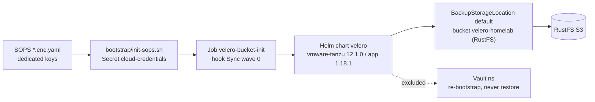

# Velero — Backup & Restore (RustFS S3)


Velero backs up cluster manifests and workload data (everything except Vault — see Vault policy below) to an external RustFS S3 bucket (`velero-homelab` at `https://rustfs.lonk-mirfak.ts.net`, from `sharedS3.tailnetFqdn`) with GitOps automation and no manual bucket setup. RustFS aborts TLS unless SNI equals its LE-cert FQDN, so every consumer dials the FQDN; the bucket-init Job keeps traffic in-cluster by resolving `s3-egress.tailscale.svc.cluster.local` via kube-dns and pinning the FQDN to those svc IPs in `/etc/hosts` at runtime (live SNI evidence 2026-09-23).

## Why this design

Velero never touches Vault (Raft PVCs, TLS, unseal material are excluded — restoring them corrupts the cluster; DR is re-bootstrap + rotation). If Velero's own S3 credentials came from Vault via ExternalSecrets, a bare-metal restore would deadlock: Vault down → no Secret → Velero can't start. Credentials are injected as a plain Kubernetes Secret before ArgoCD syncs the chart (`credentials.existingSecret: cloud-credentials`), following ADR-004 option A. Velero never reads from Vault.

Credentials file format (key `cloud`):

```ini
[default]
aws_access_key_id=AKIA...
aws_secret_access_key=...
```

## Architecture



Wave `-1` `tailscale-operator` (s3-egress Service, `DNSConfig ts-dns`, `ts.net:53` CoreDNS stub reconciler) → wave `0` `velero` + `longhorn` → wave `1` `vault`. The bucket-init Job resolves the in-cluster Service name via kube-dns (private-IP gate + runtime hosts-pin of the FQDN); the velero server pod resolves the FQDN via the cluster DNS `ts.net:53` stub (no separate `coredns-patch` chart — the reconciler lives in `platform/ts-operator`). Guarantees DNS and storage are ready before Vault creates PVCs.

## Schedules

| Schedule | Cron | Scope | TTL | Status |
|----------|------|-------|-----|--------|
| `daily-full` | `0 2 * * *` | all namespaces except `vault`, control-plane (`velero`, `kube-*`, `longhorn-system`, `argocd`) | 30d | active |
| `vault-hourly` | `0 * * * *` | `vault` namespace (retired) | 7d | `disabled: true` — see Vault policy |

- `defaultVolumesToFsBackup: true` + `deployNodeAgent: true` + `nodeAgent.enabled: true` → Longhorn PVCs backed up via filesystem copy (no CSI snapshots). The node-agent gate and the FsBackup default must stay on together.
- Resource guard: `resources.limits.memory: 512Mi` (chart default `128Mi` OOMKills during FsBackup on this homelab) — do not lower it.
- Storage: `s3ForcePathStyle: true`, `s3Url: https://<FQDN>` (from `sharedS3.tailnetFqdn`; the svc name can never complete a RustFS TLS handshake — SNI must equal the LE-cert FQDN), `region: us-east-1`, `prefix: velero/`, single BSL `default`. Server-side FQDN resolution is covered by the cluster DNS `ts.net:53` stub (`DNSConfig ts-dns` + reconciler in `platform/ts-operator`, closing the former `SERVER-RESOLUTION GAP`); the bucket-init Job additionally pins FQDN→svc-IP at runtime (see `templates/job-bucket-init.yaml`).

## Vault policy — excluded, re-bootstrap + rotation

Nothing of Vault is stored in Velero: `daily-full` carries `vault` in `excludedNamespaces`, and `vault-hourly` is disabled (kept in `values.yaml` as documentation of the retired schedule).

Restoring Raft state from Velero corrupts the cluster, and Vault holds no irreplaceable PKI/transit material, so DR is `platform/vault/scripts/bootstrap-vault.sh` (init when `initialized==false`, unseal, kv-v2 + k8s auth) followed by secret rotation — never a Velero restore.

Hourly crash-consistency for Vault volumes is a Longhorn local snapshot instead: `platform/longhorn/templates/recurringjobs.yaml` (`RecurringJob` `vault-hourly-snapshot`, `task: snapshot`, `cron: 0 * * * *`, `retain: 24`). `snapshot` is local copy-on-write; `backup` would need an S3/NFS target that is intentionally unconfigured. Volumes opt in via the `vault-hourly` group label (`recurring-job-group.longhorn.io/vault-hourly=enabled`). Daily snapshot templates for `seaweedfs`/`monitoring` are commented out in the same file.

## Quick start

```bash
# 1. Create Secret and sync (SOPS is primary — see docs/rustfs-iam.md;
#    the command below is the AWS_* fallback when the Secret is missing)
AWS_ACCESS_KEY_ID=... AWS_SECRET_ACCESS_KEY=... ./bootstrap/init-gitops.sh prod

# 2. Verify
kubectl -n velero get backupstoragelocations -o yaml  # phase: Ready
kubectl -n velero get pods -l app.kubernetes.io/name=velero
kubectl -n velero logs job/velero-bucket-init

# 3. Test backup
velero backup create manual-$(date +%Y%m%d%H%M) --wait
velero backup get
```

## Troubleshooting

| Symptom | Fix |
|---------|-----|
| `secret cloud-credentials not found` | Check SOPS secret applied (`init-sops.sh`), or re-run bootstrap with `AWS_*` env vars (fallback) |
| `NoSuchBucket` | Check `kubectl -n velero logs job/velero-bucket-init`; re-sync ArgoCD |
| `BSL not Ready` | Verify `s3Url`/`s3ForcePathStyle` and `cloud` key format is `[default]` ini |
| `nslookup s3-egress.tailscale.svc.cluster.local` fails | Verify the `s3-egress` Service exists in namespace `tailscale` and kube-dns is healthy (bucket-init Jobs resolve the svc, then pin the FQDN to those IPs in `/etc/hosts` — check `hosts-pin` lines in the job log) |
| `TLSV1_ALERT_INTERNAL_ERROR` / EOF against RustFS | The dialed host is not the LE-cert FQDN — ENDPOINT/`s3Url` must be `https://<FQDN>` (SNI fix); `--no-verify-ssl` in trailing position is unreliable, it must be global (`aws --no-verify-ssl s3api ...`) |

## Files

| Path | Purpose |
|------|---------|
| `Chart.yaml` / `values.yaml` | Wrapper chart and schedules/storage config |
| `templates/job-bucket-init.yaml` | Sync hook that creates the bucket idempotently |
| `templates/networkpolicies.yaml` | Scopes tailnet egress to `velero` namespace |
| `gitops/templates/apps/05-velero.yaml` | ArgoCD Application (wave 0) |
| `bootstrap/init-gitops.sh` | Creates `cloud-credentials` Secret |

## References

- [docs/velero.md](../../docs/velero.md) — detailed flow and wave ordering
- [docs/runbook-vault-restore.md](../../docs/runbook-vault-restore.md) — Vault DR procedure
- [ADR-004](../../docs/adrs/004-tailscale-oauth-seed-strategy.md) — bootstrap secret precedent
