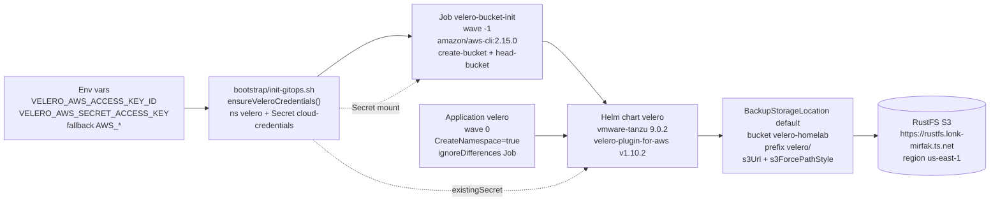

# Velero — Backup & Restore (RustFS S3)


-yellow?style=flat-square)


> **Backend:** RustFS S3 bucket `velero-homelab` at `https://rustfs.lonk-mirfak.ts.net` (S3-compatible, path-style) · **Namespace:** `velero` · **Chart:** `vmware-tanzu/velero` `9.0.2` wrapped by `platform/velero` (`1.0.0`, appVersion `1.14.1`) · **ArgoCD wave:** `0` (Job `velero-bucket-init` at wave `-1`) · **Plugin:** `velero/velero-plugin-for-aws:v1.10.2`

## Why Automation — Chicken-Egg Vault vs. Velero

Velero backs up Vault (Raft PVCs, `vault-tls`, `vault-unseal-keys`, configmaps). If Velero's own S3 credentials came from Vault via ExternalSecretsOperator (ESO), a bare-metal restore would deadlock: Vault is down → ESO cannot render the Secret → Velero cannot start → no restore.

This repo follows the precedent of [ADR-004 option A](../../docs/adrs/004-tailscale-oauth-seed-strategy.md) (ephemeral bootstrap Secret outside Vault/ESO):

- Credentials are injected as a plain Kubernetes `Secret` before ArgoCD syncs the chart.
- The chart consumes it via `credentials.existingSecret: cloud-credentials` — no Vault, no ESO in the path.
- Velero is a **consumer** of backups; Vault is never a provider for Velero's own credentials.

The format expected by the AWS plugin is an INI file under key `cloud`:

```ini
[default]
aws_access_key_id=AKIA...
aws_secret_access_key=...
```

## Architecture & Automation Flow

### Mermaid



### Numbered Flow

1. **Env** — operator or CI exports `VELERO_AWS_ACCESS_KEY_ID` / `VELERO_AWS_SECRET_ACCESS_KEY` (fallback `AWS_ACCESS_KEY_ID` / `AWS_SECRET_ACCESS_KEY` — same RustFS keys as Terraform).
2. **Bootstrap** — `bootstrap/init-gitops.sh:ensureVeleroCredentials()` ensures namespace `velero` exists and creates/updates `Secret velero/cloud-credentials` (key `cloud`, idempotent via `--dry-run=client | kubectl apply`).
3. **Job wave `-1`** — `templates/job-bucket-init.yaml` mounts that Secret at `/etc/velero/cloud`, parses `[default]` ini via `grep`/`cut`, and idempotently creates `velero-homelab` (`create-bucket` + `head-bucket`, `Prune=false`, `backoffLimit: 3`).
4. **Chart wave `0`** — ArgoCD `Application` `gitops/templates/apps/05-velero.yaml` syncs `platform/velero` (`vmware-tanzu/velero:9.0.2`) with `backupStorageLocation` pointing at RustFS (`bucket velero-homelab`, `prefix velero/`, `s3ForcePathStyle: "true"`, `s3Url: https://rustfs.lonk-mirfak.ts.net`, `region: us-east-1`), `credentials.existingSecret: cloud-credentials`, `nodeAgent.enabled: true`, `defaultVolumesToFsBackup: true`, and plugin `velero-plugin-for-aws:v1.10.2`. Runs alongside `longhorn` (wave `0`), before `vault` (wave `1`).
5. **RustFS** — `BackupStorageLocation default` becomes `Ready`; schedules write under `s3://velero-homelab/velero/`.

## What Is Backed Up

All configuration lives in [`values.yaml`](./values.yaml) under `velero:` (wrapper for the `vmware-tanzu/velero` subchart).

| Schedule | Cron | Scope | TTL | `defaultVolumesToFsBackup` |
|----------|------|-------|-----|----------------------------|
| `daily-full` | `0 2 * * *` | all namespaces (`includedNamespaces: ["*"]`), all resources | 30d (`720h`) | `true` — Longhorn PVCs via node-agent filesystem copy (no CSI snapshots required) |
| `vault-hourly` | `0 * * * *` | `vault` namespace only; `includedResources: [secrets, configmaps, persistentvolumeclaims, cronjobs]` (unseal keys, TLS, Raft PVCs) | 7d (`168h`) | `false` |

Storage:

| Field | Value |
|-------|-------|
| `backupStorageLocation[0].name` | `default` |
| `provider` | `aws` |
| `bucket` | `velero-homelab` |
| `prefix` | `velero` |
| `config.region` | `us-east-1` |
| `config.s3ForcePathStyle` | `"true"` |
| `config.s3Url` | `https://rustfs.lonk-mirfak.ts.net` |
| `volumeSnapshotLocation[0].name` | `default` (`provider: aws`, `region: us-east-1`, `snapshotVolumes: false`) |
| `credentials.existingSecret` | `cloud-credentials` (`useSecret: true`, key `cloud`) |
| `nodeAgent.enabled` | `true` |
| `features` | `veleroFeatureGates` |
| `initContainers[0]` | `velero/velero-plugin-for-aws:v1.10.2` |
| `resources` | `requests: 200m/256Mi`, `limits: 500m/512Mi` |
| `metrics/serviceMonitor` | `enabled: true` (`release: monitoring`) |

Node-agent (restic successor) is enabled cluster-wide so Longhorn volumes are backed up via filesystem copy even without CSI snapshots. The `volumeSnapshotLocation` entry is required by the chart but unused (`snapshotVolumes: false`).

## Automation Details

### 1. Bootstrap Secret — `bootstrap/init-gitops.sh:ensureVeleroCredentials()`

- **When:** called after Longhorn CSI gate, before `platform/vault/scripts/bootstrap-vault.sh` (Step 1.6 in `init-gitops.sh`).
- **Idempotent:** `kubectl create namespace velero` only if missing; `kubectl create secret generic cloud-credentials --from-literal=cloud="$CLOUD_CONTENT" --dry-run=client -o yaml | kubectl apply -f -`.
- **Resolution order:**
  1. `VELERO_AWS_ACCESS_KEY_ID` / `VELERO_AWS_SECRET_ACCESS_KEY` (preferred — allows rotation independent of Terraform state).
  2. Fallback `AWS_ACCESS_KEY_ID` / `AWS_SECRET_ACCESS_KEY` (same RustFS keys used by `infra-talos-homelab` for `terraform-homelab` backend).
- **No-fail mode:** if neither is set, logs a `WARNING` and returns `0` — Velero chart will be `Pending` (`BackupStorageLocation` unavailable) until the Secret is created. Re-run with `VELERO_AWS_ACCESS_KEY_ID=... VELERO_AWS_SECRET_ACCESS_KEY=... ./bootstrap/init-gitops.sh prod`.
- **Secret shape:** `metadata.name: cloud-credentials`, `namespace: velero`, `data.cloud: base64("[default]\naws_access_key_id=...\naws_secret_access_key=...")`.

CI path: `.github/workflows/deploy.yaml` already injects `AWS_ACCESS_KEY_ID` / `AWS_SECRET_ACCESS_KEY` to restore kubeconfig from infra state; the `Bootstrap` step inherits that env so `ensureVeleroCredentials()` works without extra secrets. Optional `VELERO_AWS_*` repo secrets can be added for separation — see [docs/velero.md §4.2](../../docs/velero.md) and [docs/ci-cd.md](../../docs/ci-cd.md).

### 2. Bucket Job — `templates/job-bucket-init.yaml` (wave `-1`)

- **Kind:** `batch/v1` `Job` `velero-bucket-init`, `namespace: velero`, conditional on `.Values.velero.enabled`.
- **Wave:** `argocd.argoproj.io/sync-wave: "-1"` — ArgoCD creates it before the `Application velero` (wave `0`).
- **Prune:** `argocd.argoproj.io/sync-options: Prune=false` + `ttlSecondsAfterFinished: 600` — Argo never prunes it; Kubernetes GCs after 10 min, logs remain inspectable until then.
- **Image:** `amazon/aws-cli:2.15.0` (`imagePullPolicy: IfNotPresent`).
- **ServiceAccount:** `default` (avoids chicken-egg with subchart `ServiceAccount velero` created in the same release).
- **Credentials:** mounts `Secret cloud-credentials` (`key: cloud → path: cloud`) at `/etc/velero/cloud`; parses with `grep -E 'aws_access_key_id' | cut -d'=' -f2 | tr -d '[:space:]'` and exports `AWS_ACCESS_KEY_ID` / `AWS_SECRET_ACCESS_KEY` / `AWS_DEFAULT_REGION=us-east-1`.
- **Idempotent logic:** `aws s3api create-bucket --bucket velero-homelab --endpoint-url https://rustfs.lonk-mirfak.ts.net --region us-east-1`; on failure checks `BucketAlreadyOwnedByYou|BucketAlreadyExists|already exists` → treat as success; otherwise exit `$RC`. Then `aws s3api head-bucket` for verification and `aws s3 ls s3://velero-homelab/` (non-fatal).
- **Retry:** `restartPolicy: OnFailure`, `backoffLimit: 3`.
- **Failure hint:** if `cloud` file missing, exits `1` with `Hint: ensure bootstrap/init-gitops.sh ensureVeleroCredentials() ran with VELERO_AWS_* or AWS_*`.

### 3. ArgoCD Wave Ordering — `gitops/templates/apps/05-velero.yaml`

- **Application:** `velero` (`velero-dev` when `developmentApp.enabled`), `namespace: argocd`, `project: default`, `source.path: platform/velero`, `helm.valueFiles: [values.yaml]` (+ `values-dev.yaml` in dev).
- **Wave:** `argocd.argoproj.io/sync-wave: "0"` — alongside `longhorn` (wave `0`), before `vault` (wave `1`), `seaweedfs` (wave `2`), `monitoring` (wave `3`), `tailscale` (wave `4`). Guarantees `BackupStorageLocation` and `node-agent` DaemonSet are `Ready` before Vault creates PVCs.
- **Sync policy:** `automated: {prune: true, selfHeal: true}`, `syncOptions: [CreateNamespace=true, ServerSideApply=true, Retry=true]`, `labels.wave-policy: healthy`.
- **ignoreDifferences:** `batch/Job` `velero/velero-bucket-init` (`/spec/selector`, `/spec/template/metadata/labels`, `/spec/template/metadata/annotations`) — prevents Argo drift on Job immutables.

## Quick Start / Verify

```bash
# 1. Bootstrap (creates Secret + triggers Job + chart)
VELERO_AWS_ACCESS_KEY_ID=... VELERO_AWS_SECRET_ACCESS_KEY=... ./bootstrap/init-gitops.sh prod
# or reuse Terraform RustFS keys:
AWS_ACCESS_KEY_ID=... AWS_SECRET_ACCESS_KEY=... ./bootstrap/init-gitops.sh prod

# 2. ArgoCD — velero must be Synced/Healthy in wave 0 before vault (wave 1)
kubectl get applications -n argocd | grep -E 'velero|vault|longhorn'

# 3. Job — wave -1 bucket init
kubectl -n velero get job velero-bucket-init
kubectl -n velero logs job/velero-bucket-init
kubectl -n velero get events --field-selector involvedObject.name=velero-bucket-init

# 4. Velero — BSL and pods
kubectl -n velero get backupstoragelocations.velero.io -o yaml
# Expected: status.phase == Ready
kubectl -n velero get volumesnapshotlocations.velero.io -o yaml
kubectl -n velero get pods -l app.kubernetes.io/name=velero
kubectl -n velero get daemonset -l app.kubernetes.io/name=velero  # node-agent
kubectl logs -n velero deploy/velero --tail=50

# 5. Backup manual (write test)
velero backup create manual-$(date +%Y%m%d%H%M) --wait --storage-location default
velero backup get
velero backup describe manual-... --details
velero backup logs manual-...

# 6. Schedules installed by the chart
kubectl -n velero get schedules.velero.io -o yaml
velero schedule get
# daily-full: 0 2 * * *, TTL 720h (30d), all namespaces, defaultVolumesToFsBackup=true
# vault-hourly: 0 * * * *, TTL 168h (7d), vault namespace only

# 7. Objects in RustFS (prefix velero/)
aws s3 ls s3://velero-homelab/velero/backups/ --endpoint-url https://rustfs.lonk-mirfak.ts.net --region us-east-1 --recursive | head
```

Verify Secret shape:

```bash
kubectl -n velero get secret cloud-credentials -o jsonpath='{.data.cloud}' | base64 -d
# [default]
# aws_access_key_id=...
# aws_secret_access_key=...
```

## Bucket Creation

### Automatic (default) — Job `velero-bucket-init` wave `-1`

No local `aws-cli` or CI step required. The Job is deployed as part of `platform/velero` and reuses the Secret already created by `ensureVeleroCredentials()`.

Verification after sync — see [Quick Start / Verify](#quick-start--verify) step 3. The Job is idempotent: re-syncing ArgoCD re-runs `create-bucket` safely; `head-bucket` confirms accessibility.

Key Job fields:

| Field | Value |
|-------|-------|
| `argocd.argoproj.io/sync-wave` | `"-1"` |
| `argocd.argoproj.io/sync-options` | `Prune=false` |
| `helm.sh/hook-weight` | `"-1"` |
| `ttlSecondsAfterFinished` | `600` |
| `backoffLimit` | `3` |
| `image` | `amazon/aws-cli:2.15.0` |
| `serviceAccountName` | `default` |
| `volume.secret.secretName` | `cloud-credentials` (`key: cloud → /etc/velero/cloud`) |
| `endpoint` | `https://rustfs.lonk-mirfak.ts.net` |
| `bucket` | `velero-homelab` |
| `region` | `us-east-1` |

### Manual Fallback — `aws s3api` (only if Job cannot run)

Use when bootstrapping without a cluster or when the Job's Secret mount is unavailable:

```bash
export AWS_ACCESS_KEY_ID="..."
export AWS_SECRET_ACCESS_KEY="..."
export AWS_ENDPOINT_URL="https://rustfs.lonk-mirfak.ts.net"

aws s3api create-bucket \
  --bucket velero-homelab \
  --endpoint-url https://rustfs.lonk-mirfak.ts.net \
  --region us-east-1

# Verify
aws s3 ls --endpoint-url https://rustfs.lonk-mirfak.ts.net --region us-east-1
aws s3api head-bucket --bucket velero-homelab --endpoint-url https://rustfs.lonk-mirfak.ts.net --region us-east-1
aws s3api get-bucket-location --bucket velero-homelab --endpoint-url https://rustfs.lonk-mirfak.ts.net --region us-east-1
```

> **RustFS notes:** `us-east-1` is mandatory even though RustFS does not validate regions. `s3ForcePathStyle: "true"` and `s3Url: https://rustfs.lonk-mirfak.ts.net` must match the public Tailscale ingress (`lonk-mirfak.ts.net`). The chart uses `prefix: velero/` to isolate objects; the manual command must use the same bucket/prefix/region.

## Troubleshooting

| Symptom | Cause | Fix |
|---------|-------|-----|
| `secret "cloud-credentials" not found` / `CreateContainerConfigError` | `ensureVeleroCredentials()` not run with env vars | `VELERO_AWS_ACCESS_KEY_ID=... VELERO_AWS_SECRET_ACCESS_KEY=... ./bootstrap/init-gitops.sh prod` or `AWS_*` fallback; verify `kubectl -n velero get secret cloud-credentials -o jsonpath='{.data.cloud}' \| base64 -d` is `[default]` ini. The Job `velero-bucket-init` also fails if the Secret is missing — check `kubectl -n velero logs job/velero-bucket-init`. |
| `NoSuchBucket: The specified bucket does not exist` | Bucket `velero-homelab` not created (Job did not run or Secret was missing at Job start) | Automatic: `kubectl -n velero get job velero-bucket-init` + `kubectl -n velero logs job/velero-bucket-init` — the wave `-1` Job creates it idempotently; re-sync ArgoCD if needed. Fallback manual: `aws s3api create-bucket --bucket velero-homelab --endpoint-url https://rustfs.lonk-mirfak.ts.net --region us-east-1`. |
| `PermanentRedirect` / `SignatureDoesNotMatch` | `s3ForcePathStyle` / `s3Url` mismatch (virtual-hosted vs path-style) | Ensure `values.yaml` has `s3ForcePathStyle: "true"` and `s3Url: https://rustfs.lonk-mirfak.ts.net` (not empty, not trailing slash). The Job uses `--endpoint-url` (path-style) consistently. |
| `BackupStorageLocation default is not in Ready state` | Invalid credentials, RustFS unreachable via Tailscale, or wrong `cloud` key format | Validate `aws s3 ls --endpoint-url https://rustfs.lonk-mirfak.ts.net --region us-east-1` from within cluster; ensure Secret key is exactly `cloud` with content `[default]\naws_access_key_id=...\naws_secret_access_key=...` (no extra spaces, no JSON). Check `kubectl -n velero describe backupstoragelocations.velero.io default` and `kubectl logs -n velero deploy/velero`. |
| `backupStoragelocations.velero.io "default" not found` | Chart not synced yet (wave `0`) | Check ArgoCD `Application velero` — must be `Synced/Healthy` before `vault` (wave `1`): `kubectl get application velero -n argocd -o yaml \| yq .status`. |
| `defaultVolumesToFsBackup` not backing up PVCs | `nodeAgent.enabled: false` or DaemonSet not scheduled | Must be `true` in `values.yaml`; verify `kubectl -n velero get daemonset -l app.kubernetes.io/name=velero` and `kubectl -n velero get pods -l app.kubernetes.io/component=node-agent`. Check `kubectl logs -n velero daemonset/velero-node-agent`. |
| Velero `ImagePullBackOff` for `velero-plugin-for-aws` | Wrong plugin tag | Pin `velero/velero-plugin-for-aws:v1.10.2` (compatible with Velero `1.14.1` / chart `9.0.2`). Verify `kubectl -n velero get pods -o jsonpath='{.items[*].spec.initContainers[*].image}'`. |
| Job `velero-bucket-init` `BackoffLimitExceeded` | Bad credentials parse or RustFS endpoint unreachable | Check `kubectl -n velero logs job/velero-bucket-init --previous`; should log sanitized file via `sed 's/=.*/=***/'` and `create-bucket` output. Verify Tailscale connectivity to `rustfs.lonk-mirfak.ts.net` and Secret parse (`grep -E 'aws_access_key_id'`). `kubectl delete job velero-bucket-init -n velero` to retry (Argo will recreate on next sync; `backoffLimit: 3`). |
| `velero backup create` hangs / `PartiallyFailed` | BSL not `Ready` or `nodeAgent` not `Ready` | `velero backup describe <name> --details` + `velero backup logs <name>`; check `kubectl -n velero get backupstoragelocations -o yaml` phase and node-agent logs. |

## Relation to Vault DR

Velero is a **complement**, not a replacement, for Vault's Raft consistency.

- Proxmox VM-level backups are **not atomic** for Raft — restoring all 3 Vault VMs from hypervisor snapshots can yield divergent Raft state. Prefer the atomic `vault operator raft snapshot save / restore` flow for point-in-time consistency.
- Velero's `vault-hourly` schedule (hourly, `vault` namespace, 7d TTL) and `daily-full` (all namespaces, 30d TTL) capture Kubernetes objects (Secrets, ConfigMaps, PVCs, CronJobs) and Longhorn volumes via `nodeAgent`, but do not guarantee Raft linearizability across nodes.

For Vault disaster recovery follow **[`docs/runbook-vault-restore.md`](../../docs/runbook-vault-restore.md)**:

> **Golden rule:** restore **only `vault-2`** at Proxmox VM level, **wipe followers** (`vault-0`, `vault-1`) via `pvc clean + raft join`, let auto-healing rejoin. `vault-autounseal` CronJob runs every `*/2` minutes to unseal and heal followers automatically. Do not restore all 3 Vault VMs simultaneously.

## Files

| Path | Purpose |
|------|---------|
| `Chart.yaml` | Wrapper chart `velero` `1.0.0` (`appVersion: 1.14.1`) depending on `vmware-tanzu/velero:9.0.2` (`condition: velero.enabled`) |
| `values.yaml` | `backupStorageLocation` (RustFS `velero-homelab`, `prefix velero/`, `region us-east-1`, `s3ForcePathStyle true`, `s3Url`), `volumeSnapshotLocation`, `schedules` (`daily-full` + `vault-hourly`), `nodeAgent.enabled`, `credentials.existingSecret cloud-credentials`, `initContainers` plugin `v1.10.2`, `resources`, `metrics/serviceMonitor` |
| `templates/namespace.yaml` | `Namespace velero` (`pod-security.kubernetes.io/enforce: privileged`) |
| `templates/job-bucket-init.yaml` | Wave `-1` `Job velero-bucket-init` (`amazon/aws-cli:2.15.0`, `Prune=false`, `ttlSecondsAfterFinished: 600`, `backoffLimit: 3`, mounts `cloud-credentials`, idempotent `create-bucket` + `head-bucket`) |
| `charts/velero-9.0.2.tgz` | Vendored subchart (Helm dependency) |
| `Chart.lock` / `.helmignore` | Helm lock / ignore |
| `README.md` | This file |
| `bootstrap/init-gitops.sh:ensureVeleroCredentials()` | Creates `namespace velero` + `Secret cloud-credentials` from `VELERO_AWS_*` (fallback `AWS_*`), idempotent, runs before Vault bootstrap |
| `gitops/templates/apps/05-velero.yaml` | ArgoCD `Application velero` wave `0` (`CreateNamespace=true`, `ignoreDifferences` for `Job` immutables), alongside `longhorn` before `vault` wave `1` |
| `../../docs/velero.md` | Deep-dive: chicken-egg, mermaid flow, wave table, Job details, secrets/CI, verification, troubleshooting |
| `../../docs/ci-cd.md` | Generic CI/CD: `validate.yaml` / `deploy.yaml` workflows, quality gates, Justfile, Renovate; §Velero bootstrap summary |
| `../../docs/runbook-vault-restore.md` | Vault DR runbook — Proxmox VM-level restore, golden rule (restore only `vault-2`, wipe followers, `*/2` autounseal) |
| `../../docs/adrs/004-tailscale-oauth-seed-strategy.md` | ADR-004 option A precedent — why some secrets live outside Vault/ESO |

## References

- Deep-dive Velero: [`docs/velero.md`](../../docs/velero.md) — chicken-egg, full mermaid, wave table, Job spec, secrets matrix, verification
- Generic CI/CD: [`docs/ci-cd.md`](../../docs/ci-cd.md) — workflows `validate.yaml` / `deploy.yaml`, Justfile, Renovate
- Vault DR runbook: [`docs/runbook-vault-restore.md`](../../docs/runbook-vault-restore.md) — Raft snapshot vs. Velero vs. Proxmox VM restore, golden rule `vault-2` only + `vault-autounseal` `*/2`
- Precedent ADR: [`docs/adrs/004-tailscale-oauth-seed-strategy.md`](../../docs/adrs/004-tailscale-oauth-seed-strategy.md) option A — bootstrap Secret outside Vault/ESO
- Infra CI/CD RustFS: `infra-talos-homelab/docs/ci-cd.md` (`deploy.yaml` → `terraform init` with `AWS_*`, `skip_*` for S3-compatible)
- Velero docs: <https://velero.io/docs/> — `BackupStorageLocation`, AWS plugin, `nodeAgent` (restic successor), `Schedule` TTL
- Chart wrapper: [`Chart.yaml`](./Chart.yaml) (`vmware-tanzu/velero:9.0.2`), [`values.yaml`](./values.yaml)

---

*Velero sits in wave 0 with Longhorn and creates the Secret outside Vault — the same pattern ADR-004 evaluates as option A. The wave `-1` Job makes `velero-homelab` bucket creation fully GitOps-automated; no manual `aws s3api` step is required unless the Job cannot run.*
