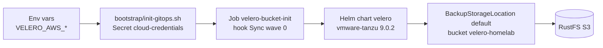

# Velero — Backup & Restore (RustFS S3)


Velero backs up the entire cluster to an external RustFS S3 bucket (`velero-homelab` at `https://rustfs.lonk-mirfak.ts.net`) with GitOps automation and no manual bucket setup.

## Why this design

Velero backs up Vault (Raft PVCs, TLS, unseal keys). If Velero's own S3 credentials came from Vault via ExternalSecrets, a bare-metal restore would deadlock: Vault down → no Secret → Velero can't start. Credentials are injected as a plain Kubernetes Secret before ArgoCD syncs the chart (`credentials.existingSecret: cloud-credentials`), following ADR-004 option A. Velero never reads from Vault.

Credentials file format (key `cloud`):

```ini
[default]
aws_access_key_id=AKIA...
aws_secret_access_key=...
```

## Architecture



Wave `-1` `tailscale-operator` → wave `0` `coredns-patch` (ts.net MagicDNS) + `velero` + `longhorn` → wave `1` `vault`. Guarantees DNS and storage are ready before Vault creates PVCs.

## Schedules

| Schedule | Cron | Scope | TTL |
|----------|------|-------|-----|
| `daily-full` | `0 2 * * *` | all namespaces, all resources | 30d |
| `vault-hourly` | `0 * * * *` | `vault` namespace (`secrets, configmaps, pvc, cronjobs`) | 7d |

- `defaultVolumesToFsBackup: true` + `nodeAgent.enabled: true` → Longhorn PVCs backed up via filesystem copy (no CSI snapshots).
- Storage: `s3ForcePathStyle: true`, `s3Url: https://rustfs.lonk-mirfak.ts.net`, `region: us-east-1`, `prefix: velero/`.

## Quick start

```bash
# 1. Create Secret and sync
VELERO_AWS_ACCESS_KEY_ID=... VELERO_AWS_SECRET_ACCESS_KEY=... ./bootstrap/init-gitops.sh prod

# 2. Verify
kubectl -n velero get backupstoragelocations -o yaml  # phase: Ready
kubectl -n velero get pods -l app.kubernetes.io/name=velero
kubectl -n velero logs job/velero-bucket-init

# 3. Test backup
velero backup create manual-$(date +%Y%m%d%H%M) --wait
velero backup get
```

## Troubleshooting

| Symptom | Fix |
|---------|-----|
| `secret cloud-credentials not found` | Re-run bootstrap with `VELERO_AWS_*` or `AWS_*` env vars |
| `NoSuchBucket` | Check `kubectl -n velero logs job/velero-bucket-init`; re-sync ArgoCD |
| `BSL not Ready` | Verify `s3Url`/`s3ForcePathStyle` and `cloud` key format is `[default]` ini |
| `nslookup rustfs.lonk-mirfak.ts.net` fails | Verify `kubectl -n kube-system get cm coredns -o yaml | grep ts.net` |

## Files

| Path | Purpose |
|------|---------|
| `Chart.yaml` / `values.yaml` | Wrapper chart and schedules/storage config |
| `templates/job-bucket-init.yaml` | Sync hook that creates the bucket idempotently |
| `templates/networkpolicies.yaml` | Scopes tailnet egress to `velero` namespace |
| `gitops/templates/apps/05-velero.yaml` | ArgoCD Application (wave 0) |
| `bootstrap/init-gitops.sh` | Creates `cloud-credentials` Secret |

## References

- [docs/velero.md](../../docs/velero.md) — detailed flow and wave ordering
- [docs/runbook-vault-restore.md](../../docs/runbook-vault-restore.md) — Vault DR procedure
- [ADR-004](../../docs/adrs/004-tailscale-oauth-seed-strategy.md) — bootstrap secret precedent
